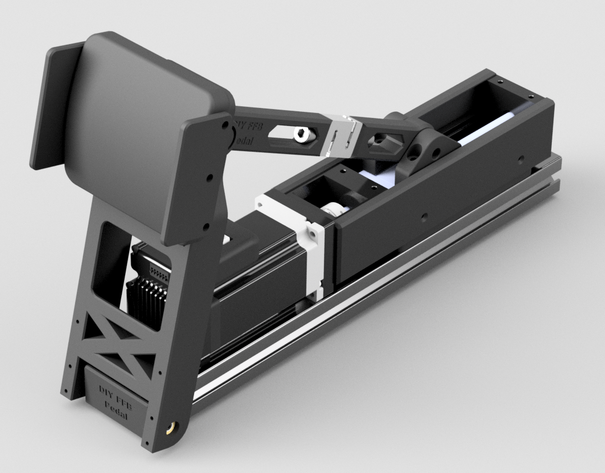

# Important Notice (Disclaimer)
> [!NOTE]
> This guide is provided exclusively for scientific and educational purposes. It is not intended for commercial use. Building and using the device is at your own risk. No warranty is given for accuracy, completeness, or safety; illegal or dangerous applications are expressly not intended or recommended. Parts lists are provided below so results can be reproduced for documentation and research purposes.

# Introduction 
## Motivation
Originally, I built my DIY FFB pedal from metal parts. After using it for some time, I became curious whether I could create a mechanical design that is mostly 3D‑printed while remaining rigid enough to withstand the heavy loads occurring in sim racing. Furthermore, I wanted to reduce the component weight, aiming for a positive impact on pedal response time. This repository documents that journey.

The 3D‑printed design has been in use since 07/2024 and shows no signs of wear in my setup.

## Problem
Metal is typically much stronger than plastic, and FDM 3D‑printed parts are generally weaker than injection‑molded counterparts.

## Solution
Create a mechanical design that takes into account the weaknesses of FDM 3D‑printed pedal parts and reinforces typical weak points.

To minimize torsional forces on the vertical pedal arms during activation, the upper load cell joint is positioned at a similar height as the center of the pedal faceplate. A deeper analysis of the pedal kinematics can be found [here](https://github.com/ChrGri/DIY-Sim-Racing-FFB-Pedal/wiki/Pedal-kinematic).

The pedal arm has additional width to reduce flex when force is applied off‑center.

As a base plate, a 3060 aluminum extrusion was chosen, as it allows direct screw‑on attachment of the linear rail guide and flexible mounting to the sim rig.

The 3D‑printed adapters

# Table of Contents
1. Overview & Design Choices
2. CAD & STL Files
3. FEM Simulation
4. Print settings
5. Assembly Steps
	- Loadcell Arm Assembly
	- Mount iSV57 Servo to Rail
	- Mount Rail to 3060 Profile
	- Prepare Pedal Arm
	- Side Guards
	- Faceplate to Pedal Arm
	- Loadcell to Pedal Arm
	- Screw Bearing
	- Loadcell Arm to Sled
	- Rail Side Covers
	- Attach PCB

# CAD & STL Files
  

The CAD model of the design can be found 
[here](CAD/DiyPedalAssemblyV3_dilatation%20v20.f3z).

# FEM Simulation
TBD.

# Print settings
For FDM printing, I chose [PETG‑CF](https://amzn.eu/d/00g90wIk), since the carbon fiber particles make the parts very stiff, and PETG provides good layer bonding while offering better heat resistance than PLA.
The PETG parts were printed with 10 perimeters, 10 top/bottom layers, and 20% infill at 270 °C hotend temperature and 70 °C bed temperature.

The 3D‑printed load cell arm adapters were printed from [83A‑TPE](https://amzn.to/4oZeoHs), which helps absorb system noise and vibration. The TPE parts were printed with 4 perimeters, 0 top/bottom layers, and 90% infill at 250 °C hotend temperature and 70 °C bed temperature.

# Assembly Steps

## Loadcell Arm Assembly
  

| Design  | Info | Quantity | STL link | Amazon (affiliate) link | Aliexpress (affiliate) link |
|--|--|--|--|--|--|
| Loadcell arm (back) | 3D print | 1 |  [Loadcell arm back](STL/Loacell-Arm-Back.stl) | | |
| Loadcell arm (front) | 3D print | 1 | [Loadcell arm back](STL/Loadcell-Arm-Front.stl) |||
| DYLY‑107 load cell | 50 kg, good signal‑to‑noise ratio | 1| || [link](https://s.click.aliexpress.com/e/_c4c2i6k5)|
| M8×16 mm cylinder head screw | | 2 | |[link](https://amzn.to/4j2gTaD) | [link](https://s.click.aliexpress.com/e/_c30VmPrT) |
| 608‑ZZ bearing | | 2 || [link](https://amzn.to/4pH0pak) | [link](https://s.click.aliexpress.com/e/_c4nGMZR7) |
| M8×45 mm threaded rod | | 2 || [link](https://amzn.to/48Iyq48) | [link](https://s.click.aliexpress.com/e/_c35xCCtj) |
| PTFE (Teflon) tape | To reduce play between rod and bearing | 1 || [link](https://amzn.to/3KzmUPj) | [link](https://s.click.aliexpress.com/e/_c3bH4vVB) |

## Mount iSV57 Servo to Rail
### Attach 8mm-to-8mm Coupler to Servo
  

| Design  | Info | Quantity | STL link | Amazon (affiliate) link | Aliexpress (affiliate) link |
|--|--|--|--|--|--|
|8mm to 8mm coupler||1||[link](https://amzn.to/4qbL1CH)|[link](https://s.click.aliexpress.com/e/_c3kPwW8h)|

Target spacing between the motor flange and the coupler is approximately 5.5 mm.

### Attach Servo to Rail

  

| Design  | Info | Quantity | STL link | Amazon (affiliate) link | Aliexpress (affiliate) link |
|--|--|--|--|--|--|
|KK 60 rail|JKK60-5-C-150-A1-F4-M|1|| [link](https://jlcmc.com/product/s/B16/BQD-JKK60/steel-linear-actuators--kk60-series) |[link](https://www.omc-stepperonline.com/de/lkn60-kk-serie-kugelgewindetrieb-linearmodul-maximale-horizontale-vertikale-nutzlast-30kg-10kg-hub-60mm-lkn60-23dl050-060?tracking=6721c5865911c)|
| M4×16 mm cylinder head screw ||4||[link](https://amzn.to/4q5GSQA)|[link](https://s.click.aliexpress.com/e/_c3bxyxud)|

## Mount Rail to 3060 Profile
  
  

| Design  | Info | Quantity | STL link | Amazon (affiliate) link | Aliexpress (affiliate) link |
|--|--|--|--|--|--|
|3060 adapter plate| |1| [3060 adapter](STL\3060_adapter\JKK60_to_3060_adapter.stl)|
| 3060 extrusion, 400 mm | | 1 | | [link](https://amzn.to/4aPx3Sj)| [link](https://s.click.aliexpress.com/e/_c39XbifP) |
| M5×20 mm cylinder head screws ||4| | [link](https://amzn.to/4j8jHD6)|[link](https://s.click.aliexpress.com/e/_c41gbyuD)|
| 3030 M5 spring ball nut ||4||[link](https://amzn.to/4qffsbd)| [link](https://s.click.aliexpress.com/e/_c38nyFEZ)|

## Prepare Pedal Arm
In order to increase layer strength, screws have been added across the layers.  
  
  

| Product | Info | Quantity | Amazon (affiliate) link | Aliexpress (affiliate) link |
|--|--|--|--|--|
|Screw 3.5mm x 30mm | To increase layer bonding | 6 | [link](https://amzn.to/3Xv7Wwl) |[link](https://s.click.aliexpress.com/e/_c4py0Uu1)|
|Screw 3.5mm x 20mm | To increase layer bonding | 2 | [link](https://amzn.to/4nTd0p1) |[link](https://s.click.aliexpress.com/e/_c4py0Uu1)|
| Countersink set | To remove material for countersunk screws | 1 |  [link](https://amzn.to/43wEfi0) |[link](https://s.click.aliexpress.com/e/_c3yAJXfL)|

## Side Guards
  
  

| Product  | Info | Quantity | STL link | Amazon (affiliate) link | Aliexpress (affiliate) link |
|--|--|--|--|--|--|
| Faceplate ||1|[Faceplate](STL/Faceplate/Faceplate.stl)||
| Side guards ||2|[Side Guards](STL/Faceplate/SideGuard.stl)||
|M5 x 20mm cylinder head screws ||6| | [link](https://amzn.to/4j8jHD6)|[link](https://s.click.aliexpress.com/e/_c41gbyuD)|

## Faceplate to Pedal Arm
  
  

| Product  | Info | Quantity | STL link | Amazon (affiliate) link | Aliexpress (affiliate) link |
|--|--|--|--|--|--|
|M5 x 30mm cylinder head screws ||2| | [link](https://amzn.to/4s0iC40)|[link](https://s.click.aliexpress.com/e/_c41gbyuD)|

## Loadcell to Pedal Arm
  
  

| Product  | Info | Quantity | STL link | Amazon (affiliate) link | Aliexpress (affiliate) link |
|--|--|--|--|--|--|
|Upper loadcell arm adapter | Print from TPE|2|[link](STL/UpperLoadcellArmAdapter/8mmUpperAdapter%20v4.stl)||
|M5 x 40mm cylinder head screws ||4| | [link](https://amzn.to/3MwzAqK)|[link](https://s.click.aliexpress.com/e/_c41gbyuD)|

## Attach Pedal Arm to 3060 Extrusion
  
  
  

| Product | Info | Quantity | STL | Amazon (affiliate) link | Aliexpress (affiliate) link |
|--|--|--|--|--|--|
| Screw bearing | JS695-13-5C3L8M6 | 2 | || [link](https://s.click.aliexpress.com/e/_c41E25K1) |
| M6 x 12 x 1.6mm flat washer |  | 2 | | [link](https://amzn.to/3MFFq98)| [link](https://s.click.aliexpress.com/e/_c3Yqn9LL) |
| 3030 M6 spring ball nut ||2||[link](https://amzn.to/4pPvLeT)| [link](https://s.click.aliexpress.com/e/_c38nyFEZ)|

## Loadcell Arm to Sled
  
  

| Product  | Info | Quantity | STL link | Amazon (affiliate) link | Aliexpress (affiliate) link |
|--|--|--|--|--|--|
| Lower load cell arm adapter | Print from TPE | 2 | [link](STL/LowerLoadcellArmAdapter/8mmLowerAdapter_v3.stl) ||
|M5 x 25mm cylinder head screws ||4| | [link](https://amzn.to/4s0sBpY)|[link](https://s.click.aliexpress.com/e/_c41gbyuD)|

## Rail Side Covers
  
  

| Product  | Info | Quantity | STL link | Amazon (affiliate) link | Aliexpress (affiliate) link |
|--|--|--|--|--|--|
| M2.5 x 6mm countersunk screws||4| | [link](https://amzn.to/3MEZUyP)|[link](https://s.click.aliexpress.com/e/_c3uZ3z3F)|

## Attach 3060 Cover 
| Product  | Info | Quantity | STL link | Amazon (affiliate) link | Aliexpress (affiliate) link |
|--|--|--|--|--|--|
|Cover||2| [Cover](STL/3060EndCover/3060_cover.stl)|

## Attach PCB
  
  

| Product  | Info | Quantity | STL link | Amazon (affiliate) link | Aliexpress (affiliate) link |
|--|--|--|--|--|--|
|Spacer||2| [Spacer](STL/PcbSpacer/PcbSpacer%20v1.stl)|
|M5 x 20mm cylinder head screws ||2| | [link](https://amzn.to/3MwzAqK)|[link](https://s.click.aliexpress.com/e/_c41gbyuD)|

