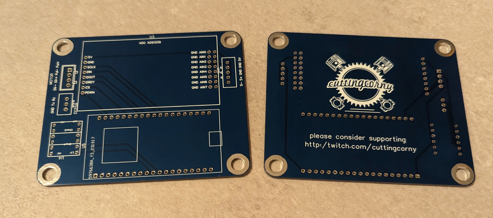
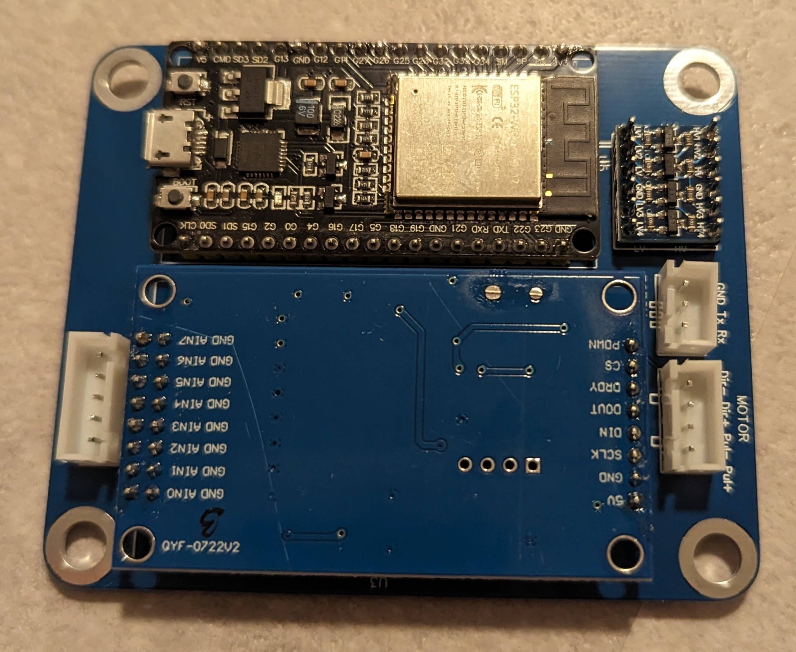
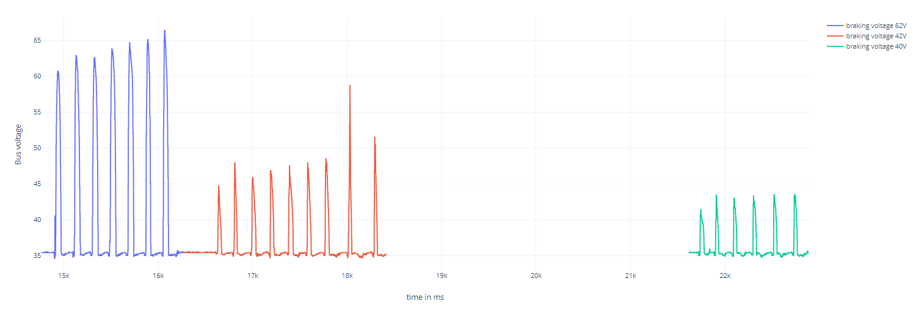
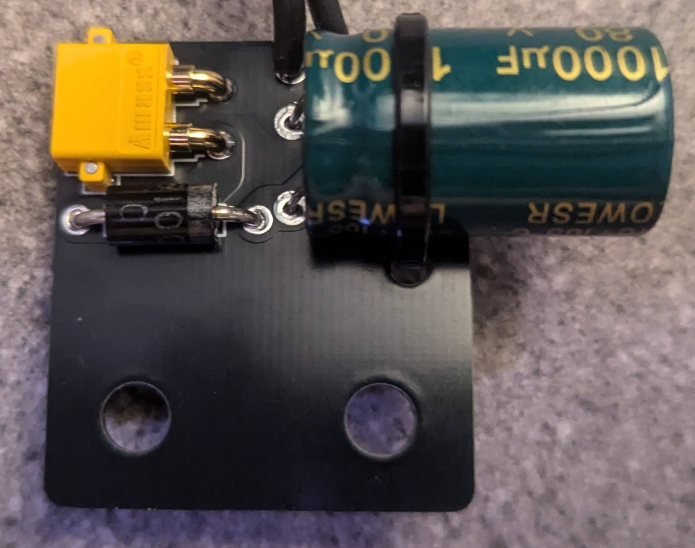
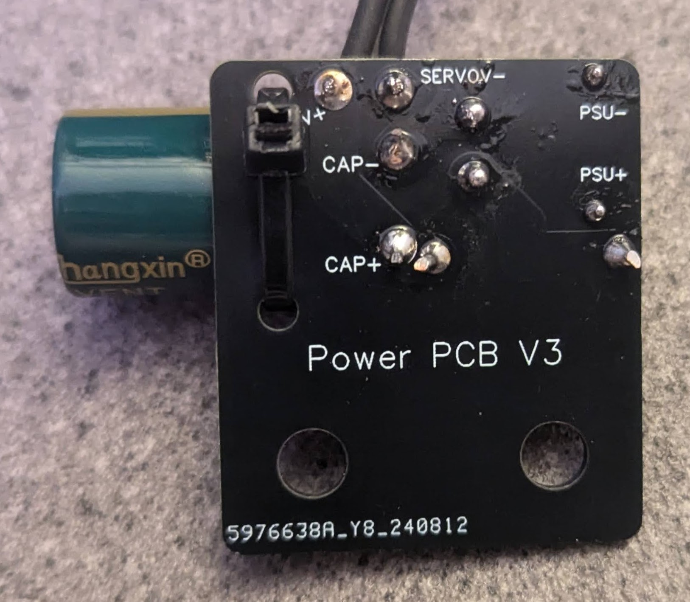
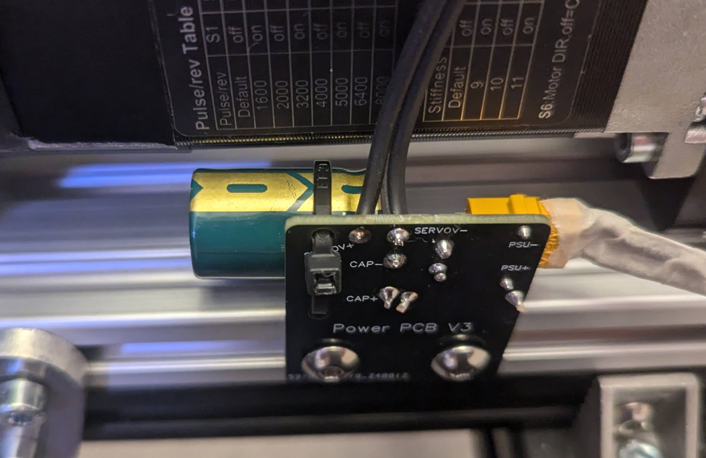

# DIY-Sim-Racing-FFB-Pedal-Mechanical-Design

# Disclaimer
This is a DIY project. Eveything at your own risk!

# License
Shield: [![CC BY-NC-SA 4.0][cc-by-nc-sa-shield]][cc-by-nc-sa]

This work is licensed under a
[Creative Commons Attribution-NonCommercial-ShareAlike 4.0 International License][cc-by-nc-sa].

[![CC BY-NC-SA 4.0][cc-by-nc-sa-image]][cc-by-nc-sa]

The reason for that license selection is that at some point in time, individuals start
- to steal the sources and binaries and sell them on the internet
- mass production of FFB pedals in their living rooms to make money by taking parts from this project and Simucubes design files.
  
All that, without contributing anything to this project.

[cc-by-nc-sa]: http://creativecommons.org/licenses/by-nc-sa/4.0/
[cc-by-nc-sa-image]: https://licensebuttons.net/l/by-nc-sa/4.0/88x31.png
[cc-by-nc-sa-shield]: https://img.shields.io/badge/License-CC%20BY--NC--SA%204.0-lightgrey.svg

# Project repositories
This project has been divided into multiple repositories, each with differt purposes. The mechanical design repository provides the information you need to build the mechanics of ChrGri's pedal. It's not the only design, but it's strong and reliable. There are more options on the Wiki, and you can find even more designs on the Discord server. The Software repo (this repo) discusses how to select, order and connect the electronics, flash the firmware and get the pedal up and running. The final repo, contains designs for the recommended circuit boards that control the pedal.
| Description           |  Link |
:------------------------- | :------------------------- |
| ChrGri's mechanical and electrical design | https://github.com/ChrGri/DIY-Sim-Racing-FFB-Pedal-Mechanical-Design |
| Software (firmware, SimHub plugin, ...) |https://github.com/ChrGri/DIY-Sim-Racing-FFB-Pedal |
| Control Board and Power Board design | https://github.com/gilphilbert/DIY-Sim-Racing-FFB-Pedal-PCBs |

# Support the team
We :heart: doing research. New hardware (e.g. oscilloscopes, logic analyzers, servos, PCBs) is very expensive. Feel free to support us and thus fasten up the research activity.

Dev | captainchris | tcfshcrw | gilphilbert
--- | --- |--- |-- 
Buy me a coffee |  |  |    | 
Ko-fi |  | |   |

# Motivation
Originally, I built my DIY FFB pedal from metal parts. After using it some time, I got curious whether I can come up with a mechanical design that can be mostly 3d printed and is still rigid enough to withstand the heavy loads accuring in simracing. Furthermore, I wanted to reduce the weight of the components, hopefully seeing a positive impact in the pedal response time. This repo documents the journey of doing that.

# Problem
Usually metal is much stronger than plastic and FDM 3d printed parts are weaker than injection molded counterparts. 

# Solution
Create a mechanical design, which takes into account the weaknesses of using FDM 3d printed pedal parts and make them strong at weak spots.

Here is a description of the design choices:

To minimize torsional force on the vertical pedal arms arising through pedal activation, the upper loadcell joint is placed at similar height as the pedal face plate centrum. A deeper analysis of the pedal kinematics can be found [here](https://github.com/ChrGri/DIY-Sim-Racing-FFB-Pedal/wiki/Pedal-kinematic).

Since the upper loadcell joint is located rather high, a SFU1610 spindle with 10mm pitch was selected to allow fast pedal movement. Lower pitch spindle could provide more torque and thus axial force but at the cost of reduced movement speed. Also, the SFU1610 spindle typically emmits less noise and feel smother than 1605 spindles.

The linked linear guide was selected, since it has 30mm M4 bold pattern, which works perfectly fine with the SK12 blocks (32mm spacing, 6mm holes). 100mm stroke length is more than needed. 75mm or even 50mm might be sufficient for some users. Alternatively [these](https://jlcmc.com/product/s/B16/BQD-JKK60/steel-linear-module-kk60-series#selection-tab) linear guides are really nice too and even can be ordered with covers, but are more expensive and use 30mm M5 bold pattern which cannot be used out of the box with the SK12 blocks.

The loadcell joints are from off-the-shelf SK12 shaft supports. They are easy to source, reasonably cheap and therefore a good buyout option. Since they are made from matel, they are likely stronger than your bones.

The beefy loadcell was choosen, as it has a M12 thread, which allows easy connection with the M12 ball joint. [These](https://a.aliexpress.com/_Ez2kYuf) loadcells are nice too, but would require adapters or redesign of the loadcell arm.

The pedal arms have a certain width to it, to reduce flex, when pedal force is applied off-centre.

As a base-plate a 2080 aluminium extrusion was chooses as it allows easy screw on of attachments as well as easy and flexible attachment to the simrig.

As a FDM material I choosed [PETG-CF](https://amzn.eu/d/00g90wIk), since the carbon fibre particales make the parts supper stiff and the PETG gives good layer bonding while having a better heat resistance than PLA.

# Overview

## Mechanical design
The mechanical design is depicted below  

## Electronics

### Control PCB
The embedded code of this DIY FFB pedal runs on an ESP32 microcontroller. The PCB design was developed to prove the concept. It holds the ESP32, the ADC, a level shifter, and connectors. Currently, version 3 of this PCB design is used which introduced sensorless homing of the servo. The PCB design and pinout diagram can be found [here](Wiring/Esp32_V3). When a Simucube wheelbase is used, the D15 accessory port can be used for input. For details see [here](Wiring/PCB_analog_output)

Here is an image of the plain PCB:

Here is an image of the assembled PCB:

To order the PCB, follow the [instructions](README.md#order-pcb).

HINT:
The proposed PCB is easy to source, but requires manual soldering. The awesome user [gilphilbert](https://github.com/gilphilbert) designed a PCB assembly of the control board which can be found [here](https://github.com/gilphilbert/DIY-Sim-Racing-FFB-Pedal-PCBs). It's currently beeing tested. The current status is published on the discord channel.

### Optional but recommended: Power PCB

Depending on the load direction, the servo will act as a generator. It will produce an additional (reverse) current flow from the servo to the PSU which could trigger the over-voltage protection of the PSU and the servo. The iSV57 has a "bleeding/braking resistor" method to dissipate the current flow as heat and thus reduce voltage spikes causing overvoltage protection trigger. The method will be activated when a predefined bus voltage is exceeded (currently 40V). A plot of the voltage fluctuations can be found below:

The trigger voltage was varied in the test (blue: 62V; red: 42V; green: 40V). The horizontal axis shows the time, the vertical axis shows the bus voltage. The pedal was activated a few times, resultig in voltage spikes due to EMF. It can be seen, that the height of the voltage spikes correlate with the trigger voltage. Since the trigger voltage is set to 40V, it is strongly recommended to use a PSU with less than 40V output, otherwise the method will be always active, resulting in an overheating servo. 

Although the iSV57s internal braking resistor method is reliably and mostly sufficient, a power PCB was developed to prevent reverse current flow to the PSU and thus prevent triggering the over-voltage protection of the PSU, by adding a Schottky diode to the power line. To prevent the trigger of the over/under-voltage protection of the servo, a small capacitor was added in the power-line. 

To hold the components in a small package, a [power PCB](Wiring/PowerPcb/V3) was developed, which also featured a port to hold XT30 connectors. 

Photos of the assembled PCB are depicted below:  
 
 

A 3d printable housing for the power PCB be found [here](STL/PowerPcbV3Guard.stl). It's depicted in the image below.  

A deeper analysis of the reverse current flow and investigation of brake circuits can be found [here](https://github.com/tcfshcrw/Brake_resistor_Control_Circuit).

### Wiring
The wiring is depicted in the image below  

Warning: The input voltage must not exceed 39V. Recommended voltage is anything between 32V and 37V. 
When the supplied Voltage exceeda 39V, the servo coils might be energized all the time, resulting in excessive heat.

The [Stepperonline documentation](https://www.omc-stepperonline.com/index.php?route=product/product/get_file&file=1641/User%20Manual%20Of%20iSV2-57TR-48V400A.pdf) suggests to use AWG16 wiring.

# BOM
Given prices are just indicators. Sellers regularly offer discounted prices, e.g. I paid for the iSV57 60€, for the linear rail 46€.

Disclosure: Some of the links below are affiliate links, which means we may receive a commission at no cost to you if you make a purchase. By using the provided links, you help me buy tools or hardware for further investigations.

## Mechanical parts

### Larger parts
| Part  | Info | Quantity | Price | Amazon link | Aliexpress link | 
| ------------- | ------------- | ------------- | ------------- | ------------- | ------------- |
| SK12  | | 4 pieces  | 4,50€ | https://amzn.eu/d/074hrmhx | https://a.aliexpress.com/_EHTevax |
| 608zz bearing  | | 2 pieces  | 5€ | https://amzn.eu/d/0j1mJTMV | https://a.aliexpress.com/_Eyd05UR|
| Linear guide  | SFU1610, 100mm stroke | 1 piece  | 60€ | https://a.aliexpress.com/_EJxA4A5 |https://a.aliexpress.com/_EJWoX55 |
| 2080 profile  | 400mm length | 1 piece  | 15€ | https://amzn.eu/d/08zlueLh | https://a.aliexpress.com/_EwWe0in |
| M12 ball joint  | All right handed thread | 2 piece  | 11€ | https://amzn.eu/d/02ZegheX | |
| M8 threades rod  |  |  one piece ca. 110mm length | 2€ | local hardware store | https://a.aliexpress.com/_EHIOY4T |
| M12 threades rod  |  | two pieces a 45mm + two pieces a 55mm  | 2€ | local hardware store | https://a.aliexpress.com/_EvmkpLN |
| M8 self locking nut  |  | 2 pieces  | 0,50€ | local hardware store |  |
| M5 t-nut  |  | 8 pieces  | 3€ | https://amzn.eu/d/0e2KYTZu | https://a.aliexpress.com/_EyKq6Mx |
| FDM filament  |  | ca. 300g  | 25€ | https://amzn.eu/d/00g90wIk | |

### Srews/bolds:
| Size  | Info | Quantity | Price | Link |
| ------------- | ------------- | ------------- | ------------- | ------------- |
| M4x10mm  | | 8 pieces  | 0,50€ |
| M4x15mm  | | 8 pieces  | 0,50€  |
| M5x10mm  | | 4 pieces  | 0,50€ |
| M5x25mm  | | 4 pieces  | 0,50€ |
| M5x30mm  | | 10 pieces  | 0,50€ |
| M4 washer  | | 4 pieces  | 0,50€ |

## Electronics:

Apart from the mechanical parts, more electronical parts have to be ordered. Please conduct the [software/electronics](https://github.com/ChrGri/DIY-Sim-Racing-FFB-Pedal) repo and the discord for help first, to see if electronic parts are still up to date. 
### Generic parts:
| Part  | Info | Quantity | Price | Primary link | Secondary link | 
| ------------- | ------------- | ------------- | ------------- | ------------- | ------------- |
| iSV57T-130S  | shorter version ("130s") is prefered. If the longer version ("130") is cheaper, buy this and cut the motor shaft to appropriate length with a metal handsaw. Alternatively the 180s servo is a bit stronger and not selled out that often. | 1 piece  | 90€ | [130s link](https://www.omc-stepperonline.com/de/nema-23-integrierter-easy-servo-motor-130w-3000rpm-0-45nm-63-73oz-in-20-50vdc-buerstenloser-dc-servomotor-kurze-welle-isv57t-130s?tracking=6721c5865911c) | [180s link](https://www.omc-stepperonline.com/de/nema-23-integrierter-easy-servo-motor-180w-3000rpm-0-6nm-84-98oz-in-20-50vdc-servomotor-kurze-welle-isv57t-180s?tracking=6721c5865911c)|
| PSU | 1 PSU can power multiple pedals (2 at least) | 1 piece | 25€ | [link](https://www.omc-stepperonline.com/de/lrs-350-36-mean-well-350w-36vdc-9-7a-115-230vac-geschlossenes-schaltnetzteil-lrs-350-36?tracking=6721c5865911c) | |
| Loadcell  | 200kg | 1 piece  | 20€ | [link](https://amzn.eu/d/0erHqGqH) | [link](https://a.aliexpress.com/_EJwp9Ht) |
| Servo debug port connector  | Female, 5P | 1 piece  | 1€ | [link](https://pt.aliexpress.com/item/1005005418641238.html?srcSns=sns_Copy&spreadType=socialShare&bizType=ProductDetail&social_params=60746685474&aff_fcid=1d45d6e48d444964bd22a0f42d53f3c8-1723186511849-07071-_EJ2en8z&tt=MG&aff_fsk=_EJ2en8z&aff_platform=default&sk=_EJ2en8z&aff_trace_key=1d45d6e48d444964bd22a0f42d53f3c8-1723186511849-07071-_EJ2en8z&shareId=60746685474&businessType=ProductDetail&platform=AE&terminal_id=e96ca77e674742f88e254e5a68e4e328&afSmartRedirect=y) | | 

### Control PCB:  
Different connectors are listed below (see option #1 & #2) you'll only need one. The screw terminals are prefered, as (a) they don't require a crimped wire connection and (b) aren't as sensitive to force appied on the wires as JST connectors.

| Part  | Info | Quantity | Price | Amazon link | Aliexpress link | 
| ------------- | ------------- | ------------- | ------------- | ------------- | ------------- |
| Wire (AWG 18 - 26)  | to connect the control electronics |  | 5€ | local hardware store | |
| ADS1256 |  | 1 unit per pedal | 17€ | https://www.amazon.de/DollaTek-ADS1256-8channel-Hochpr%C3%A4zise-Erfassungsdaten/dp/B07DK5GC9H/ref=sr_1_1?__mk_de_DE=%C3%85M%C3%85%C5%BD%C3%95%C3%91&crid=3IMTK3BD1INKG&dib=eyJ2IjoiMSJ9.0XcPpbD68w9-qv4_XvkKfSEDVbaFo-FAqVOFUhoX_VM297QTE3OvKVKVJAnub8Kqp605MBjeVHv4ROlxDvomwFd3noH9IXHY2OJEqiGO7vL8JuqmIwOup9c3Z-YMXLtGoo8gKOUM89hVIb_FUZX_9aAQM0bcohMdnl2XF7NA8ZoaVmZE-J-g45piaUHkAiSgDe7eaatEd0bzxo7G42qfRYfPeQPHDssIi5GdiyuQPllMAF1u56WyOvL3Sn_lkRfGpzpzJZDt5pImiX9QFxvH7I6pqCmJflgQ_h9PJbMBFdw.ZSi_dZr3_x8M3hxphOrjP2tR8wX0da2bRuMiUFNte_k&dib_tag=se&keywords=ads1256&qid=1723186683&s=industrial&sprefix=ads1256%2Cindustrial%2C90&sr=1-1 | |
| ESP32 |  | 1 unit per pedal | 21€ | https://www.amazon.de/diymore-Entwicklungsplatine-NodeMCU-Module-Bluetooth/dp/B09Z6RLS7R/ref=sr_1_3?keywords=esp32&qid=1691818759&sr=8-3 | |
| Level shifter |  | 1 unit per pedal | 7€ | https://www.amazon.de/gp/product/B082F6BSB5/ref=ppx_yo_dt_b_search_asin_title?ie=UTF8&psc=1 | |
| Option #1: 2.54mm pitch screw terminals ||| 13€| https://amzn.eu/d/5S0YVBn | |
| Option #2: JST connector box |  |  | 8€ | https://www.amazon.de/YIXISI-Stecker-Weiblich-Adapter-M%C3%A4nnlich/dp/B082ZLYRRN/ref=sr_1_5?crid=254ZPUWLFHGL6&dib=eyJ2IjoiMSJ9.l39XnEYEV6Ryx1pfoR2sNktKIEQX4EXCXe4ZIRUU3c9TmBn8o_FsiZqQeO49AtcP5eKMo84mj8w2164M9E9YsOqqjtblQWaRYOs0jjAckkvwwZX8sFITdnAvPF2CRgS_wIf4bfagSC1VDW41wNbjtz8H5rm5ehFT53HpMR_EU3DjoL-MqLbQWU9TOo1W1MUmwkpJRhhbCZ4CIX15wu_y9i9Pg_ZTtu9_PJ4M-S3HXa6BqxfyTvmPNLUdGDk-rOdfY6wdY0G_rZKW1zobu9UQzbKL7udM7SEqOUvRwfmqQ_k.XaYzAodgy0_8csPGMh_dJjSo_PNRFgG4959KTJIOZjc&dib_tag=se&keywords=jst+stecker&qid=1723186313&sprefix=jst+%2Caps%2C72&sr=8-5 | |
| Control PCB | Ordered from JLCPCB | 1 unit per pedal | 5€ | https://github.com/ChrGri/DIY-Sim-Racing-FFB-Pedal/blob/develop/Wiring/Esp32_V3/Gerber_PCB_V3.zip | |

### Power PCB:  

| Component | Info |  Link |
:-------------------------| :---- | :-------------------------
| SR5100 Schottky diode | 1 diode per pesal | [Aliexpress](https://de.aliexpress.com/item/1005006761992465.html?spm=a2g0o.order_list.order_list_main.16.67a25c5fWiYucW&gatewayAdapt=glo2deu) |
| 80V 1mF capacitor| 1 cap per pedal | [Aliexpress](https://de.aliexpress.com/item/1005005355860881.html?spm=a2g0o.order_list.order_list_main.10.67a25c5fWiYucW&gatewayAdapt=glo2deu) |
| XT30 connector angled | 1 male connector per pedal | [Aliexpress](https://de.aliexpress.com/item/32919173824.html?spm=a2g0o.order_list.order_list_main.4.67a25c5fWiYucW&gatewayAdapt=glo2deu)|
|XT30 connector straight| For PSU wire, xt30, female |[Aliexpress](https://a.aliexpress.com/_EzlkTFf)|
| 1mm2 cable  | 1m | local hardware store |

# List of printed parts

The print orientation was choosen manually. Support was activated only for the part PedalArmLowerBar.stl.

| Part  | Quantity | Required |
| ------------- | ------------- | ------------- |
| [608zzHolder](STL/608zzHolder.stl)  | 2  | yes |
| [CncModuleHolder](STL/CncModuleHolder.stl)  | 2  | yes |
| [CncModuleHolderLeft](STL/CncModuleHolderLeft.stl)  | 2  | yes |
| [Faceplate](STL/Faceplate.stl)  | 1  | yes |
| [PedalArmLeft](STL/PedalArmLeft.stl)  | 1  | yes |
| [PedalArmRight](STL/PedalArmRight.stl)  | 1  | yes |
| [PedalArmLowerBar](STL/PedalArmLowerBar.stl)  | 1  | yes |
| [PedalArmUpperAdapter](STL/PedalArmUpperAdapter.stl)  | 1  | yes |
| [PedalSideGuard](STL/PedalSideGuard.stl)  | 1  | no |

To close the 2080 extrusion front/back, the following part was printed twice:  
[2080 profile cap](https://makerworld.com/models/209499) 

To cover the PSU channels, thr following thing was used (recommended to print at 101% scale, since it was designed with 0% tolerance):  
https://www.thingiverse.com/thing:5158578

An adapter to mount the PSU to 4040/4080 aluminium extrusions can be found here:  
[STL](STL/PSU/LRS_Holder.stl)  
[CAD](CAD/PSU/LRS_Holder.f3d)

It requires the following screws:  
4x M4x8mm  
2x M5x15mm   
2x M5 t-nut for 4040 profile  

## Parts for JKK rail

Design files for the [JKK60 rail](https://jlcmc.com/product/s/B16/BQD-JKK60/steel-linear-module-kk60-series#selection-tab) can be found [here](https://github.com/ChrGri/DIY-Sim-Racing-FFB-Pedal-Mechanical-Design/tree/main/CAD/JKK_rail).

# Print settings
I printed with 10 perimeters, 10 top/bottom layers, 20% infill. 270°C hotend temperature, 70°C heated bed temperature.

# Assembly instructions

Mount CNC guide to 2080 profile with: 
4x M4x10mm  
4x M5x25mm  
2x printed "CncModuleHolder"  
2x printed "CncModuleHolderLeft"  

Mount pedal plate to pedal arms:  
8x M5x30mm  
2x SK12  

Mount 608zz adapter to 2080 profile:  
2x printed "608zzHolder"  
2x 608zz bearing  
M8x100 rod  
4x M5x10mm

Mount SK12 to linear guide: 
4x M4x15mm 
4x M4 washer 
2x SK12 

Mount iSV57 to linear guide: 
4x M4x15mm

Loadcell:  
2x M12x55mm threaded rod  
2x M12 nut

Loadcell to SK12:  
2x M12x45mm threaded rod

# Tips
To reduce any play in the system, I wrapped some layers of [teflon wrap](https://amzn.eu/d/0cYW6pJp) around the threaded rods and pushed the 608zz bearings and ball rods over it.

# Analysis results
To test the mechanical design, following test were conducted:

## Strength test
To be done! 

Perhaps FEM analysis

## Control loop test
To be done!

Compared to the stainless steel pedal plate, the pedal feels more responsive. Need to verify that by e.g. plotting the closed loop step response here.

Todo:   
1) Weight the parts/pedals.
2) Draw dimensions
3) Capture step respose

# CAD resources
Linear guide  
https://grabcad.com/library/sgx-linear-module-1

608zz  
https://grabcad.com/library/608-skate-board-bearing-1

iSV57  
https://www.omc-stepperonline.com/de/nema-23-integrierter-easy-servo-motor-130w-3000rpm-0-45nm-63-73oz-in-20-50vdc-buerstenloser-dc-servomotor-kurze-welle-isv57t-130s

SK12  
https://grabcad.com/library/sk08-shaft-support-1

2080  
https://grabcad.com/library/2080-aluminium-extrusion-european-standard-t6-1

M12 female rod end  
https://grabcad.com/library/female-rod-end-m12-1

Loadcell   
https://grabcad.com/library/m12-threaded-s-type-tension-compression-load-cell-1000kg-1

# Options

Instead of the 608zz bearing, one can also buy two [KP08 bearing blocks](https://a.aliexpress.com/_EzwSNtB)
and take the bearings from there. The benefit is, that they have a screw flange to remove any play between bearing and axis. An example assembly is depicted below:

.

# Issues

## Issue 1: servo slips away
It was observed, that the servo slipped away under braking, see [video](https://www.youtube.com/live/HW_phDLIBcU?si=4mNCj0IyTrodPuNm&t=2854).

A different [PSU](https://amzn.eu/d/3srstaF) was used as the one linked in the BOM. It is assumed that due to heavy braking the PSU wasn't able to deliver the necessary power output and the servo went into undervoltage protection, this slipping away. 
Its currently beeing tested, whether that is issue is solved by switching the the PSU from the BOM and what software chnages can mitigate the symptoms in the future.

Updates on this issue will be posted here and almost daily on [youtube](https://youtube.com/@cuttingcorny?si=7AVNgqsLwYK21lRO).

A big thank you to Cuttingcorny for reporting the issue and helping to track the issue down.

Status from 8th september 2024: 
The PSU from the BOM is now in use. The V3 power PCB as well. With the old software < release 84, the servos overvoltage protection was triggered. After switching to firmware release 85, the pedal seems to work fine. With release 85, new servo parameterization was introduced to reduce EMF of the servo. 
The problem was thus solved with hardware changes (mainly switch of PSU) and software changes (parameterization of the servos internal braking resistor mode).

# Order PCB
1. Download the control and power PCB, e.g. [control PCB V3](Wiring/Esp32_V3/Gerber_PCB_V3.zip)
2. Navigate to https://jlcpcb.com/
3. Upload the gerber files
4. Leave the standard settings (2 layers, FR-4, 1.6mm, PCB color of your choice, see image below), check which delivery options is the cheapest  

5. Oder the PCB
6. Wait for the delivery. Typically 10 days to europe.
7. Solder the electrical compontens onto the PCBs. Refer to the assembled PCB images from above. A good soldering iron makes your life easier. I like [TS80](https://a.aliexpress.com/_EJJYk9f) and [TS101](https://a.aliexpress.com/_EjxNjCp) soldering irons. 

## Star History

