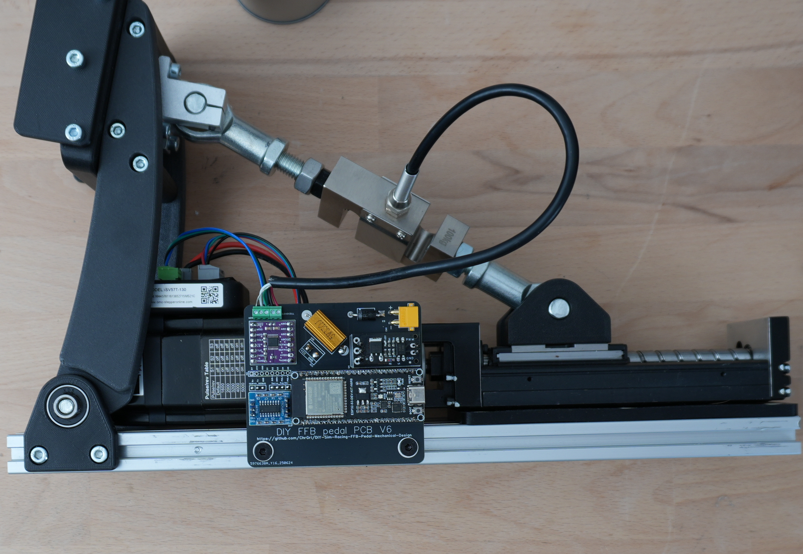

# DIY-Sim-Racing-FFB-Pedal-Mechanical-Design
If you're used to standard spring or damper-based pedals with rumble motors attached, a force-feedback pedal is the next step. It uses a high power servo attached to a linear rail to control the motion of the pedal. This allows you to change how the pedal feels with a few changes on your PC, whether that's braking pressure, response or travel or the thottle weight or stiffness. You can even use profiles to build different "feels" for different cars, switching profiles between cars to give each vehicle a different driving experience. Additionally, since the pedal movement is controlled, the feedback it can produce is totally different - imaging feeling ABS feedback moving the pedal, the kick of the gear change through the throttle or feedback from road bumps through the pedals. It's an experience like no other! If that sounds like something you want to build for yourself, then read on! This project documents people who want to design and/or build their own force-feedback pedal. 

> [!TIP]
> **Disclaimer** This repository documents my research progress. I wanted to understand the necessary signal processing and control theory algorithms behind such a device. 

> [!WARNING]
> The FFB pedal is a robot and can be dangerous. Please watch [The Terminator](https://en.wikipedia.org/wiki/The_Terminator) before continuing. If not interacted with care, it may cause harm. I'm not responsible for any harm caused by this design suggestion. Use responsibly and at your own risk.

# Project repositories
This project has been divided into multiple repositories, each with differt purposes. The mechanical design repository provides the information you need to build the mechanics of ChrGri's pedal. It's not the only design, but it's strong and reliable. There are more options on the Wiki, and you can find even more designs on the Discord server. The Software repo (this repo) discusses how to select, order and connect the electronics, flash the firmware and get the pedal up and running. The final repo, contains designs for the recommended circuit boards that control the pedal.
| Description           |  Link |
:------------------------- | :------------------------- |
| ChrGri's mechanical and electrical design | https://github.com/ChrGri/DIY-Sim-Racing-FFB-Pedal-Mechanical-Design |
| Software (firmware, SimHub plugin, ...) |https://github.com/ChrGri/DIY-Sim-Racing-FFB-Pedal |
| Control Board and Power Board design | https://github.com/gilphilbert/DIY-Sim-Racing-FFB-Pedal-PCBs |

# Support the team
We :heart: doing research. New hardware (e.g. oscilloscopes, logic analyzers, servos, PCBs) is very expensive. Feel free to support us and thus fasten up the research activity.

Dev | captainchris | tcfshcrw | gilphilbert
--- | --- |--- |-- 
Buy me a coffee |  |  |    | 
Ko-fi |  | |   |

# License
Shield: [![CC BY-NC-SA 4.0][cc-by-nc-sa-shield]][cc-by-nc-sa]

This work is licensed under a
[Creative Commons Attribution-NonCommercial-ShareAlike 4.0 International License][cc-by-nc-sa].

[![CC BY-NC-SA 4.0][cc-by-nc-sa-image]][cc-by-nc-sa]

The reason for that license selection is that at some point in time, individuals start
- to steal the sources and binaries and sell them on the internet
- mass production of FFB pedals in their living rooms to make money by taking parts from this project and Simucubes design files.
  
All that, without contributing anything to this project.

[cc-by-nc-sa]: http://creativecommons.org/licenses/by-nc-sa/4.0/
[cc-by-nc-sa-image]: https://licensebuttons.net/l/by-nc-sa/4.0/88x31.png
[cc-by-nc-sa-shield]: https://img.shields.io/badge/License-CC%20BY--NC--SA%204.0-lightgrey.svg

# Motivation
Originally, I built my DIY FFB pedal from metal parts. After using it some time, I got curious whether I can come up with a mechanical design that can be mostly 3d printed and is still rigid enough to withstand the heavy loads accuring in simracing. Furthermore, I wanted to reduce the weight of the components, hopefully seeing a positive impact in the pedal response time. This repo documents the journey of doing that.

The 3D printed design is in use since 07/2024 and doesn't show any signs of wear on my side. 

# Problem
Usually metal is much stronger than plastic and FDM 3d printed parts are weaker than injection molded counterparts. 

# Solution
Create a mechanical design, which takes into account the weaknesses of using FDM 3d printed pedal parts and make them strong at weak spots.

Here is a description of the design choices:

To minimize torsional force on the vertical pedal arms arising through pedal activation, the upper loadcell joint is placed at similar height as the pedal face plate centrum. A deeper analysis of the pedal kinematics can be found [here](https://github.com/ChrGri/DIY-Sim-Racing-FFB-Pedal/wiki/Pedal-kinematic).

Since the upper loadcell joint is located rather high, a SFU1610 spindle with 10mm pitch was selected to allow fast pedal movement. Lower pitch spindle could provide more torque and thus axial force but at the cost of reduced movement speed. Also, the SFU1610 spindle typically emmits less noise and feel smother than 1605 spindles.

The linked linear guide was selected, since it has 30mm M4 bold pattern, which works perfectly fine with the SK12 blocks (32mm spacing, 6mm holes). 100mm stroke length is more than needed. 75mm or even 50mm might be sufficient for some users. Alternatively [these](https://jlcmc.com/product/s/B16/BQD-JKK60/steel-linear-module-kk60-series#selection-tab) linear guides are really nice too and even can be ordered with covers, but are more expensive and use 30mm M5 bold pattern which cannot be used out of the box with the SK12 blocks.

The loadcell joints are from off-the-shelf SK12 shaft supports. They are easy to source, reasonably cheap and therefore a good buyout option. Since they are made from matel, they are likely stronger than your bones.

The beefy loadcell was choosen, as it has a M12 thread, which allows easy connection with the M12 ball joint. [These](https://s.click.aliexpress.com/e/_DFQ8bjx) loadcells are nice too, but would require adapters or redesign of the loadcell arm.

The pedal arms have a certain width to it, to reduce flex, when pedal force is applied off-centre.

As a base-plate a 2080 aluminium extrusion was chooses as it allows easy screw on of attachments as well as easy and flexible attachment to the simrig.

As a FDM material I choosed [PETG-CF](https://amzn.eu/d/00g90wIk), since the carbon fibre particales make the parts supper stiff and the PETG gives good layer bonding while having a better heat resistance than PLA.

# Overview

## Mechanical design
The mechanical design is depicted below  

## Electronics

### Documentation of soldering and assembly
The embedded code of this DIY FFB pedal runs on an ESP32 S3 microcontroller. The PCB design was developed to prove the concept. It holds the ESP32, the ADC, a RS232 transceiver, brake resistor circuit and connectors. Currently, version 6 of this PCB design is being used, see  
.

The pictured documentation of the soldering and assembly can be found [here](Soldering).

A good soldering iron makes your life easier. I like [TS80](https://s.click.aliexpress.com/e/_DkivtvJ) and [TS101]https://s.click.aliexpress.com/e/_DkVMKwN) soldering irons. 

Soldering tips can be found [here](https://www.youtube.com/watch?v=DfC5FBsud7o).

### Hardware features
For the interessted reader, some deeper analysis can be found [here](Features)

### Ordering
To order the PCB, follow the [instructions](README.md#order-pcb).

HINT:
The proposed PCB is easy to source, but requires manual soldering. The awesome user [gilphilbert](https://github.com/gilphilbert) designed a PCB assembly of the control board which can be found [here](https://github.com/gilphilbert/DIY-Sim-Racing-FFB-Pedal-PCBs). It's currently beeing tested. The current status is published on the discord channel.

# BOM
Given prices are just indicators. Sellers regularly offer discounted prices, e.g. I paid for the iSV57 60€, for the linear rail 46€.

Disclosure: Some of the links below are affiliate links, which means we may receive a commission at no cost to you if you make a purchase. By using the provided links, you help me buy tools or hardware for further investigations.

## Mechanical parts

### Larger parts
| Part  | Info | Quantity | Price | Amazon link | Aliexpress link | 
| ------------- | ------------- | ------------- | ------------- | ------------- | ------------- |
| SK12  | | 4 pieces  | 4,50€ | [link](https://amzn.to/4fibyZe) | [link](https://s.click.aliexpress.com/e/_DlVHbol) |
| 608zz bearing  | | 2 pieces  | 5€ | [link](https://amzn.to/4grWl92) | [link](https://s.click.aliexpress.com/e/_DC5FMbP) |
| Linear guide  | SFU1610, 100mm stroke | 1 piece  | 60€ | [link](https://a.aliexpress.com/_EJWoX55) | |
| 2080 profile  | 400mm length | 1 piece  | 15€ | [link](https://amzn.to/4glrw63) | [link](https://s.click.aliexpress.com/e/_DEPruwN) |
| M12 ball joint  | All right handed thread | 2 piece  | 11€ | [link](https://amzn.to/3Dqoyyq) | |
| M8 threades rod  |  |  one piece ca. 110mm length | 2€ | local hardware store | [link](https://s.click.aliexpress.com/e/_Dmk4XgV) |
| M12 threades rod  |  | two pieces a 45mm + two pieces a 55mm  | 2€ | local hardware store | [link](https://s.click.aliexpress.com/e/_DCL5p3L) |
| M8 self locking nut  |  | 2 pieces  | 0,50€ | local hardware store |  |
| M5 t-nut  |  | 8 pieces  | 3€ | [link](https://amzn.to/3DhZ1Yi) | [link](https://a.aliexpress.com/_EyKq6Mx) |
| FDM filament  |  | ca. 300g  | 25€ | [link](https://amzn.to/4gbUhly) | |

### Srews/bolts:
| Size  | Info | Quantity | Price | Link |
| ------------- | ------------- | ------------- | ------------- | ------------- |
| M4x10mm  | | 8 pieces  | 0,50€ |
| M4x15mm  | | 8 pieces  | 0,50€  |
| M5x10mm  | | 4 pieces  | 0,50€ |
| M5x25mm  | | 4 pieces  | 0,50€ |
| M5x30mm  | | 10 pieces  | 0,50€ |
| M4 washer  | | 4 pieces  | 0,50€ |

## Electronics:

Apart from the mechanical parts, more electronical parts have to be ordered. Please conduct the [software/electronics](https://github.com/ChrGri/DIY-Sim-Racing-FFB-Pedal) repo and the discord for help first, to see if electronic parts are still up to date. 

### Generic parts:
| Part  | Info | Quantity | Price | Primary link | Secondary link | 
| ------------- | ------------- | ------------- | ------------- | ------------- | ------------- |
| iSV57T-130S  | shorter version ("130s") is prefered. If the longer version ("130") is cheaper, buy this and cut the motor shaft to appropriate length with a metal handsaw. Alternatively the 180s servo is a bit stronger and not selled out that often. | 1 piece  | 90€ | [130s link](https://www.omc-stepperonline.com/de/nema-23-integrierter-easy-servo-motor-130w-3000rpm-0-45nm-63-73oz-in-20-50vdc-buerstenloser-dc-servomotor-kurze-welle-isv57t-130s?tracking=6721c5865911c) | [180s link](https://www.omc-stepperonline.com/de/nema-23-integrierter-easy-servo-motor-180w-3000rpm-0-6nm-84-98oz-in-20-50vdc-servomotor-kurze-welle-isv57t-180s?tracking=6721c5865911c)|
| PSU | 1 PSU can power multiple pedals (2 at least) | 1 piece | 25€ | [link](https://www.omc-stepperonline.com/de/lrs-350-36-mean-well-350w-36vdc-9-7a-115-230vac-geschlossenes-schaltnetzteil-lrs-350-36?tracking=6721c5865911c) | |
| Loadcell  | 50kg or 100kg | 1 piece  | 20€ | [link](https://amzn.eu/d/0erHqGqH) | [link](https://s.click.aliexpress.com/e/_DlBk3oV) |
| Servo debug port connector  | Female, 5P | 1 piece  | 1€ | [link](https://s.click.aliexpress.com/e/_oCbioHZ) | | 

### Control PCB:  
The components for the V5 PCB are listed below. 

| Part  | Info | Quantity | Price | Amazon link | Aliexpress link | 
| ------------- | ------------- | ------------- | ------------- | ------------- | ------------- |
| Control PCB | Ordered from JLCPCB | 1 unit per pedal | 18€ | [link](Wiring/PcbV5/DiyFfbPedalPcbV5.zip) | |
| ESP32 S3 waveshare  | 8MB-Not Soldered | 1 | 13€ | [link](https://amzn.to/3CbEBAg) | [link](https://s.click.aliexpress.com/e/_oEhAfE9) |
| ADS1220 |  | 1 unit per pedal | 1€ | [link](https://amzn.to/4eMUyLL) | [link](https://s.click.aliexpress.com/e/_ooJvpag) |
| SP2323  |  Single channel 20x16 | 1 | 1€ | [link](https://amzn.to/3CkFxlP) | [link](https://s.click.aliexpress.com/e/_onolG33) |
| SR5100 Schottky diode | |  1 diode per pedal | 1€ | [link](https://amzn.to/3CmN8jR)| [link](https://s.click.aliexpress.com/e/_DdrrsrJ) |
| FR120N mosfet | 100V | 1 per pedal | 1€ |[link](https://amzn.to/40MX27z) | [link](https://s.click.aliexpress.com/e/_oEP6IpR)|
| 10 or 33 Ohm 5W resistor | select 10R or 33R | 1 per pedal | 1€ | [link](https://amzn.to/43ZmYgW)| [link](https://s.click.aliexpress.com/e/_okeL0HJ)|
| Wire (AWG 18)  | power wire | 0.2m | 5€ | [link](https://amzn.to/4htGLtR) | [link](https://s.click.aliexpress.com/e/_oke6LFx) |
| Wire (AWG 30)  | to connect the control electronics | 0.2m | 5€ | [link](https://amzn.to/4geYNz0) | [link](https://s.click.aliexpress.com/e/_olWGFI1) |
| 2.54mm pitch screw terminals | 5 pin (2pin + 3pin) for loadcell to board | 1 per pedal | 6€| [link](https://amzn.eu/d/5S0YVBn) | [link](https://s.click.aliexpress.com/e/_opeMwmZ) |
| XT30 connector angled | | 1 male connector per pedal | | [link](https://amzn.to/4jvW86S) | [link](https://s.click.aliexpress.com/e/_DCIcYHF)|
| Pin header | optionally, select female | | 1€| [link](https://amzn.to/4hySFCT) | [link](https://s.click.aliexpress.com/e/_ooJnkBP)|

## Alterations
Here are some nice upgrades.

### 608zz to KP08 bearing

Instead of the 608zz bearing, one can also buy two [KP08 bearing blocks](https://s.click.aliexpress.com/e/_Dk7Wokt)
and take the bearings from there. The benefit is, that they have a screw flange to remove any play between bearing and axis. An example assembly is depicted below:

.

### JKK rail

I'm currently using a [JKK60-10-P-150-A1-F4-C-M](https://jlcmc.com/product/s/B16/BQD-JKK60/steel-linear-module-kk60-series#selection-tab) on my trottle. It's noticeably quieter than the Aliexpress guide. However, it was almost 5 times as expensive inlcuding shipping and taxes. To hold the JKK rail, a 3d printable adapter is used, which can be found [here](CAD/JKK_rail_chris/Jkk_to_2080_adapter v1.stl). 

### DYLY-107 loadcell
Instead of the beefy loacell, smaller ones can be found [here](https://s.click.aliexpress.com/e/_DFQ8bjx). No immediate performance upgrade was observed. 

The thread of the DYLY-107 loadcell is M8. The beefy loadcell has a M12 thread. 

Needed changes: 
- Instead of using a SK12, a SK8 block fits well, e.g. [link](https://s.click.aliexpress.com/e/_okuBOQ9)
- balljoints: switch to M8 type balljoints, e.g. [link](https://s.click.aliexpress.com/e/_opZom53)
- The remaining M12 rods have to be exchanged by M8 versions.

# List of printed parts

The print orientation was choosen manually. Support was activated only for the part PedalArmLowerBar.stl.

| Part  | Quantity | Required |
| ------------- | ------------- | ------------- |
| [608zzHolder](STL/608zzHolder.stl)  | 2  | yes |
| [CncModuleHolder](STL/CncModuleHolder.stl)  | 2  | yes |
| [CncModuleHolderLeft](STL/CncModuleHolderLeft.stl)  | 2  | yes |
| [Faceplate](STL/Faceplate.stl)  | 1  | yes |
| [PedalArmLeft](STL/PedalArmLeft.stl)  | 1  | yes |
| [PedalArmRight](STL/PedalArmRight.stl)  | 1  | yes |
| [PedalArmLowerBar](STL/PedalArmLowerBar.stl)  | 1  | yes |
| [PedalArmUpperAdapter](STL/PedalArmUpperAdapter.stl)  | 1  | yes |
| [PedalSideGuard](STL/PedalSideGuard.stl)  | 1  | no |
| [V5 PCB case lower part](CAD/PcbV5case/V5PcbCaseLowerPart.stl)  | 1  | no |
| [V5 PCB case upper part](CAD/PcbV5case/V5PcbCaseUpperPart.stl)  | 1  | no |

To close the 2080 extrusion front/back, the following part was printed twice:  
[2080 profile cap](https://makerworld.com/models/209499) 

To cover the PSU channels, thr following thing was used (recommended to print at 101% scale, since it was designed with 0% tolerance):  
https://www.thingiverse.com/thing:5158578

An adapter to mount the PSU to 4040/4080 aluminium extrusions can be found here:  
[STL](STL/PSU/LRS_Holder.stl)  
[CAD](CAD/PSU/LRS_Holder.f3d)

It requires the following screws:  
4x M4x8mm  
2x M5x15mm   
2x M5 t-nut for 4040 profile  

# Print settings
I printed with 10 perimeters, 10 top/bottom layers, 20% infill. 270°C hotend temperature, 70°C heated bed temperature.

# Assembly instructions

Mount CNC guide to 2080 profile with: 
4x M4x10mm  
4x M5x25mm  
2x printed "CncModuleHolder"  
2x printed "CncModuleHolderLeft"  

Mount pedal plate to pedal arms:  
8x M5x30mm  
2x SK12  

Mount 608zz adapter to 2080 profile:  
2x printed "608zzHolder"  
2x 608zz bearing  
M8x100 rod  
4x M5x10mm

Mount SK12 to linear guide: 
4x M4x15mm 
4x M4 washer 
2x SK12 

Mount iSV57 to linear guide: 
4x M4x15mm

Loadcell:  
2x M12x55mm threaded rod  
2x M12 nut

Loadcell to SK12:  
2x M12x45mm threaded rod

# Tips
To reduce any play in the system, I wrapped some layers of [teflon wrap](https://amzn.eu/d/0cYW6pJp) around the threaded rods and pushed the 608zz bearings and ball rods over it.

# Analysis results
To test the mechanical design, following test were conducted:

## Strength test
To be done! 

Perhaps FEM analysis

## Control loop test
To be done!

Compared to the stainless steel pedal plate, the pedal feels more responsive. Need to verify that by e.g. plotting the closed loop step response here.

Todo:   
1) Weight the parts/pedals.
2) Draw dimensions
3) Capture step respose

# CAD resources
Linear guide  
https://grabcad.com/library/sgx-linear-module-1

608zz  
https://grabcad.com/library/608-skate-board-bearing-1

iSV57  
https://www.omc-stepperonline.com/de/nema-23-integrierter-easy-servo-motor-130w-3000rpm-0-45nm-63-73oz-in-20-50vdc-buerstenloser-dc-servomotor-kurze-welle-isv57t-130s

SK12  
https://grabcad.com/library/sk08-shaft-support-1

2080  
https://grabcad.com/library/2080-aluminium-extrusion-european-standard-t6-1

M12 female rod end  
https://grabcad.com/library/female-rod-end-m12-1

Loadcell   
https://grabcad.com/library/m12-threaded-s-type-tension-compression-load-cell-1000kg-1

# Order PCB
1. Download the control and power PCB, e.g. [control PCB V3](Wiring/Esp32_V3/Gerber_PCB_V3.zip)
2. Navigate to https://jlcpcb.com/
3. Upload the gerber files
4. Leave the standard settings (2 layers, FR-4, 1.6mm, PCB color of your choice, see image below), check which delivery options is the cheapest  

5. Oder the PCB
6. Wait for the delivery. Typically 10 days to europe.
7. Solder the electrical compontens onto the PCBs. Refer to the assembled PCB images from above. A good soldering iron makes your life easier. I like [TS80](https://s.click.aliexpress.com/e/_DkivtvJ) and [TS101]https://s.click.aliexpress.com/e/_DkVMKwN) soldering irons. 
8. Soldering tips can be found [here](https://www.youtube.com/watch?v=DfC5FBsud7o).

## Simhub plugin configuration
When using the PCB and mechanical design from this repo, tune the Simhub plugin as suggested below.

### CDC setting
Working settings with V5 PCB for CDC and DTR/RTS are depicted below   

### Pedal  kinematic
To accurately estimate the pedal force, the controller needs information of the geometric design. Open the **PEDAL-KINEMATIC** tab and adjust the values accordingly. 

O to A = 215 
A to B = 66 
O to C = 167 
C to D = 0 
C to B = 233 

The controller will automatically measure the travel distance. If you want it not to hit the max endstop, reduce the travel distance below the acctual travel distance of the sled.

## Star History

