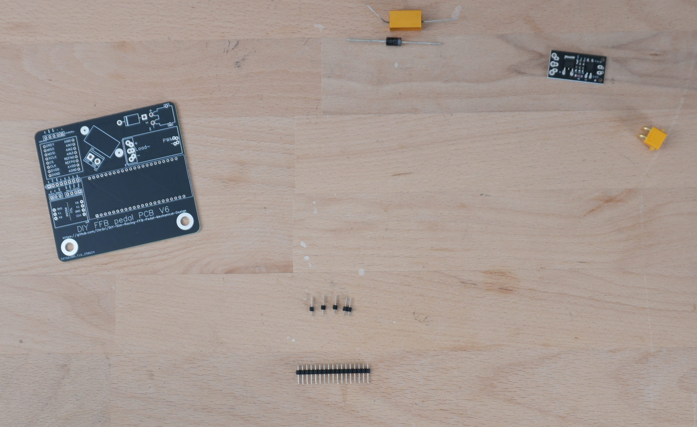
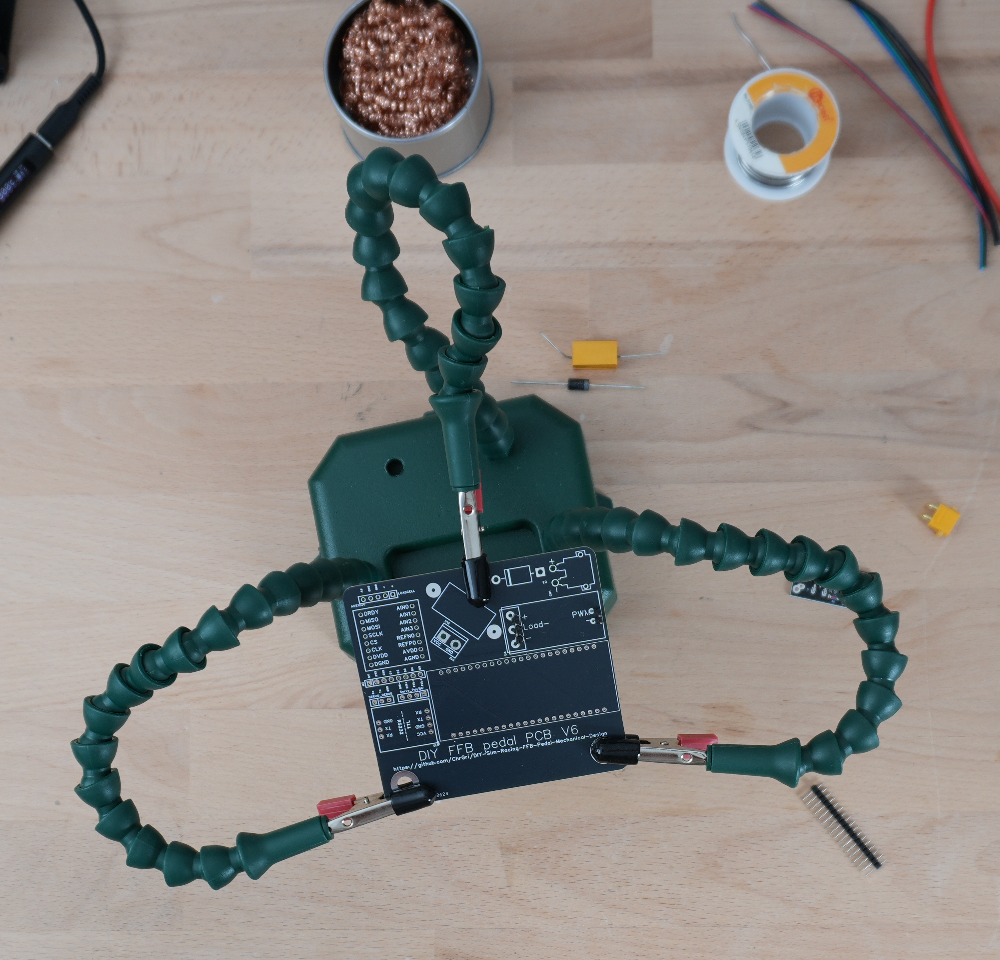
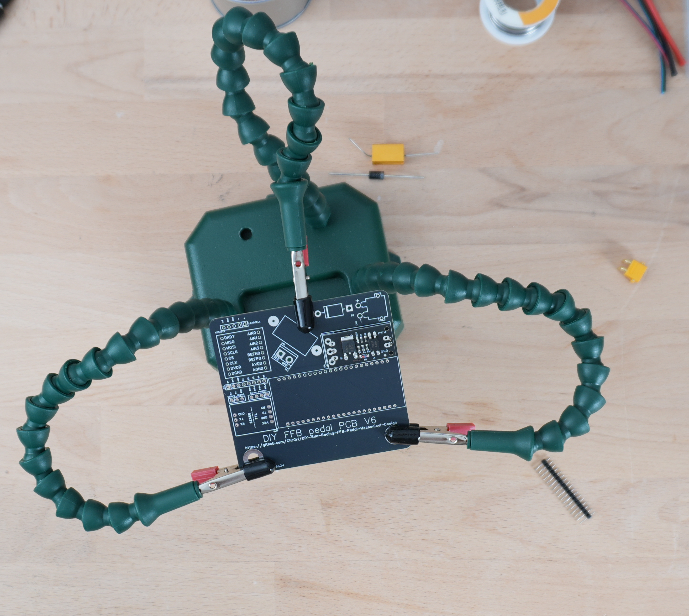
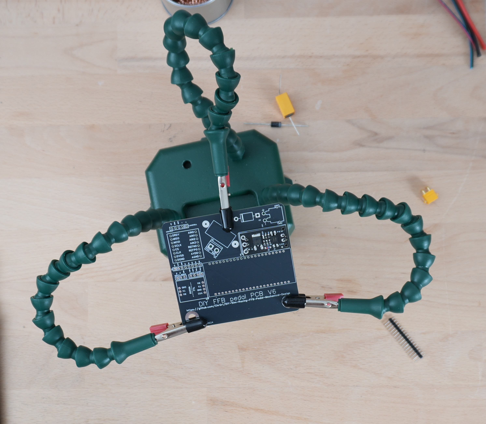
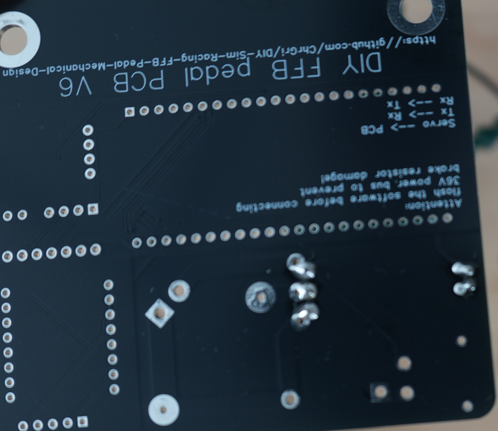
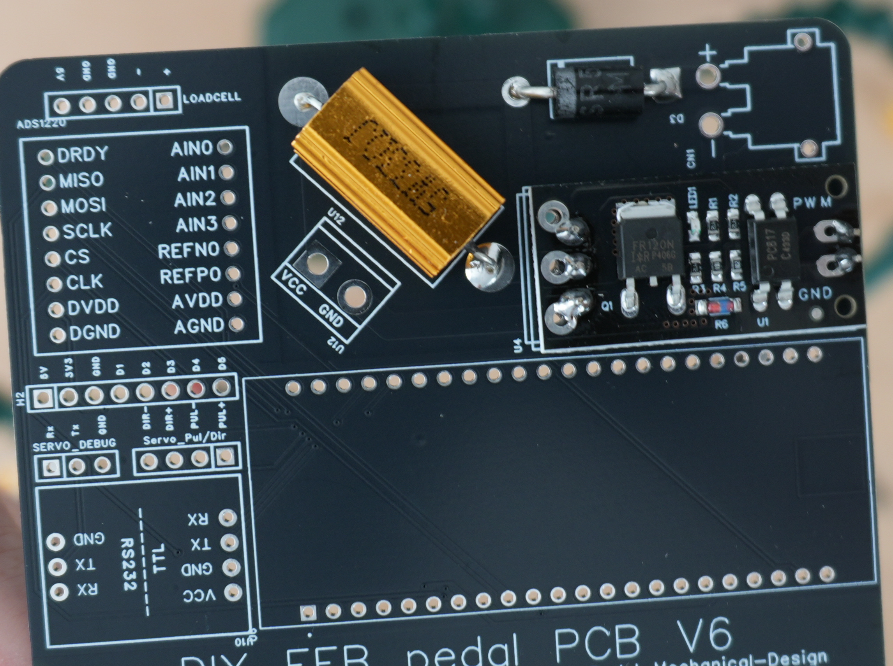

# FR120

From the 2.54mm pin header 3 single pins and a two pin element was cut, see  

The pins were placed in the PCB as shown below.  

Then the FR120 was placed on top of that, see

The top side was soldered first 
,

the bottom side afterwards
.

# SR5110
In the next stage, the SR5110 Schottky diode was soldered. The correct polarity is marked on the board. It was bend to fit through the corresponding holes 

and the leads of the Schottky diode have been shortened  
.

# Brake resistor
Similary, the brake resistor has been soldered to the board, see  
.
It has no special polarity.
