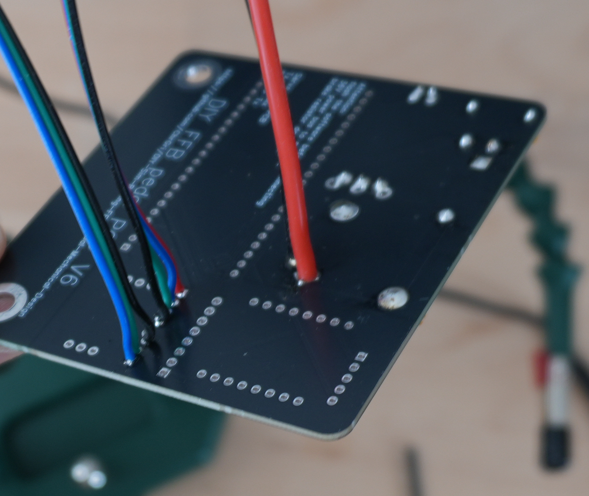

# Cut all wires to length

For wiring two power cables (AWG 18), a 3 wire and a 4 wire control cables (AWG 30) are needed. All wires were cut to 15cm length  
. 

# Soldering
Next, the power wires were soldered from the back.  

Similary the control cables are soldered from the back, see  
  
.

