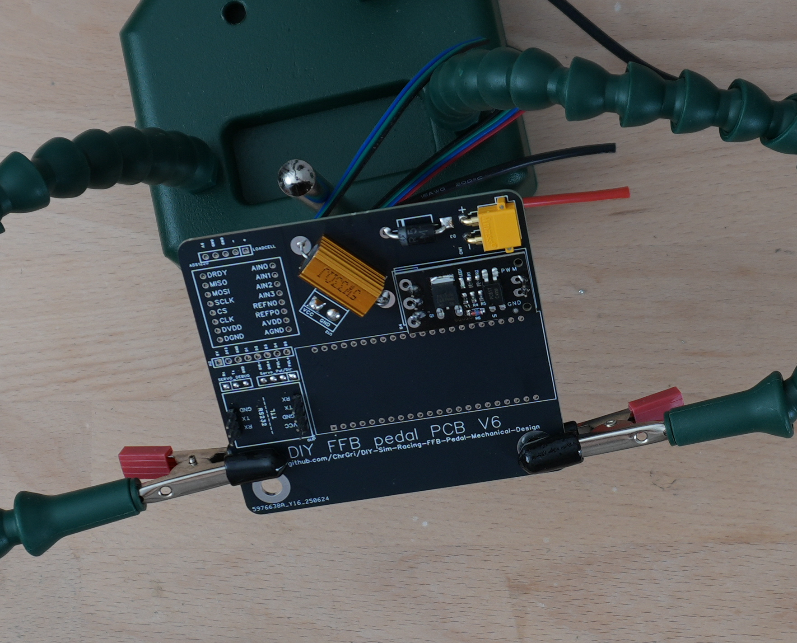
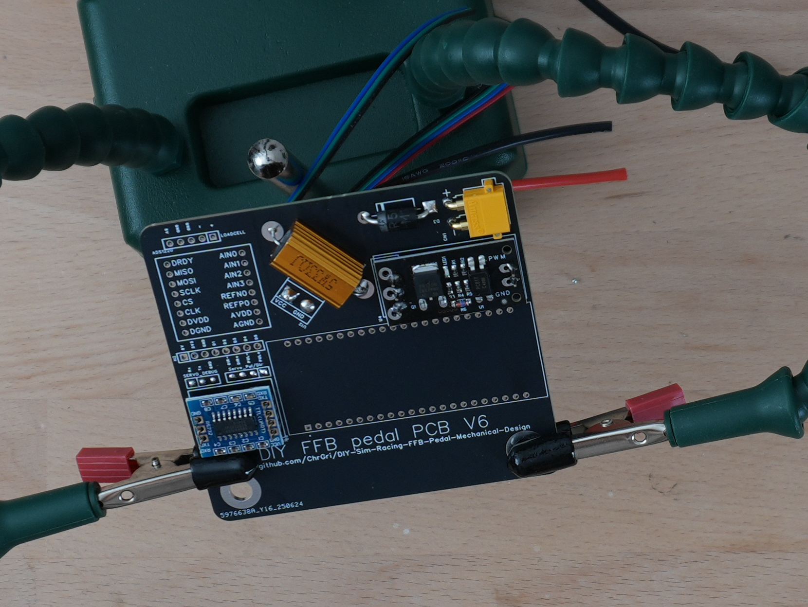
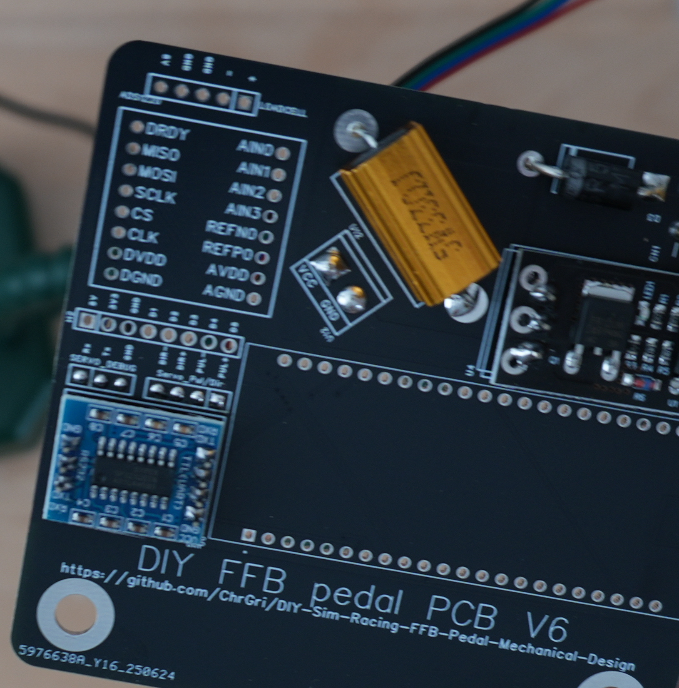

# SP3232 assembly
Slice off a 3 and a 4 pin header from the header row. Put them on the PCB, see
. 

Place the SP3232 on the header pins next, see
. 

At first, the top pins have been soldered, afterwards the bottom pins were soldered. The final result is shown below  
. 

