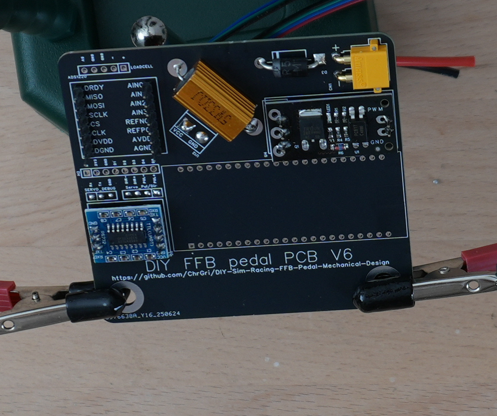
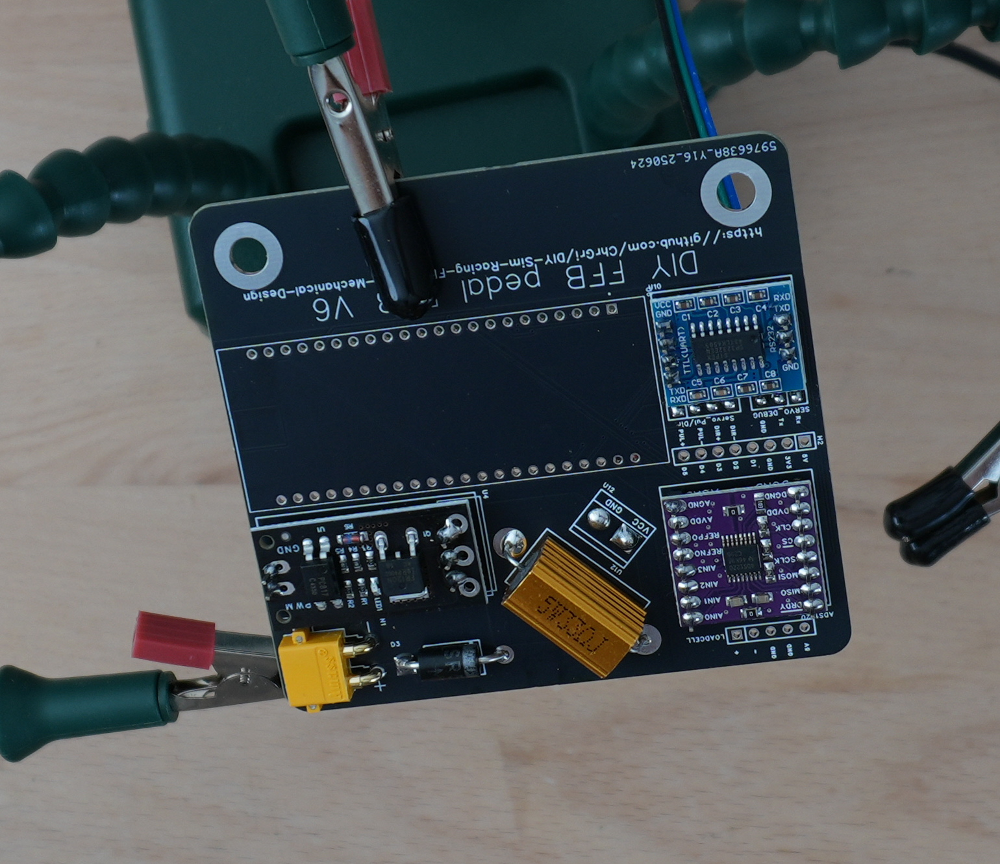
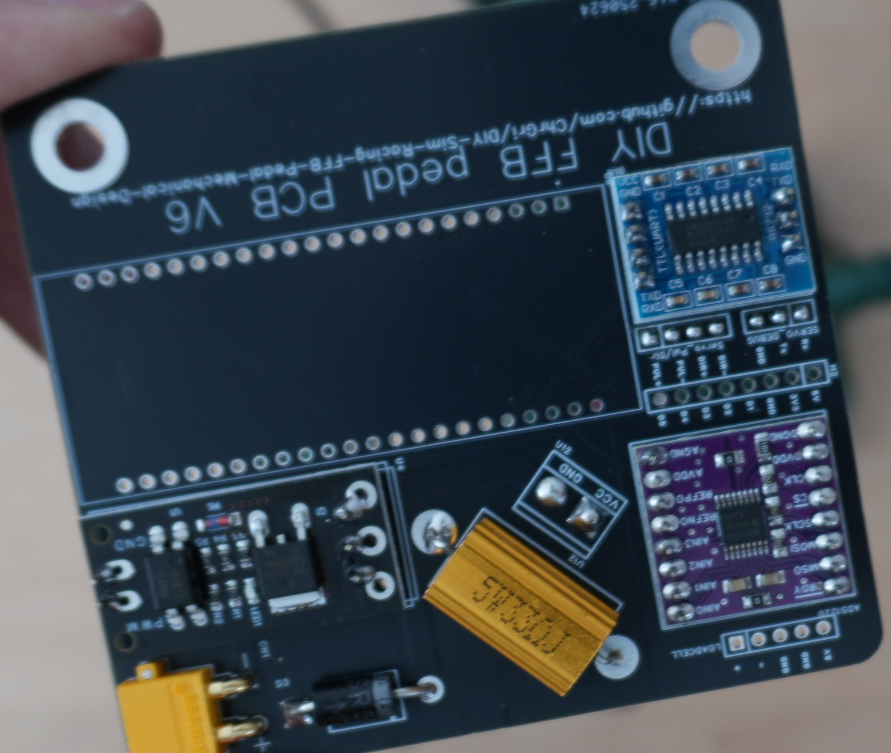
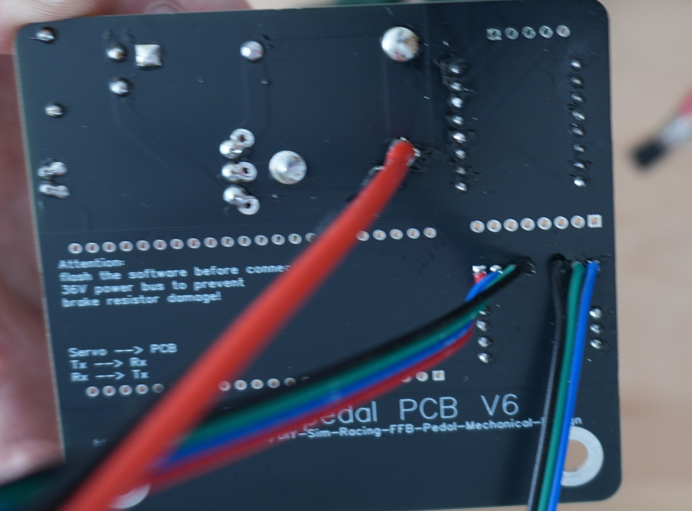
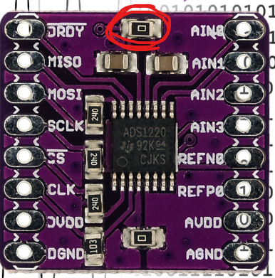
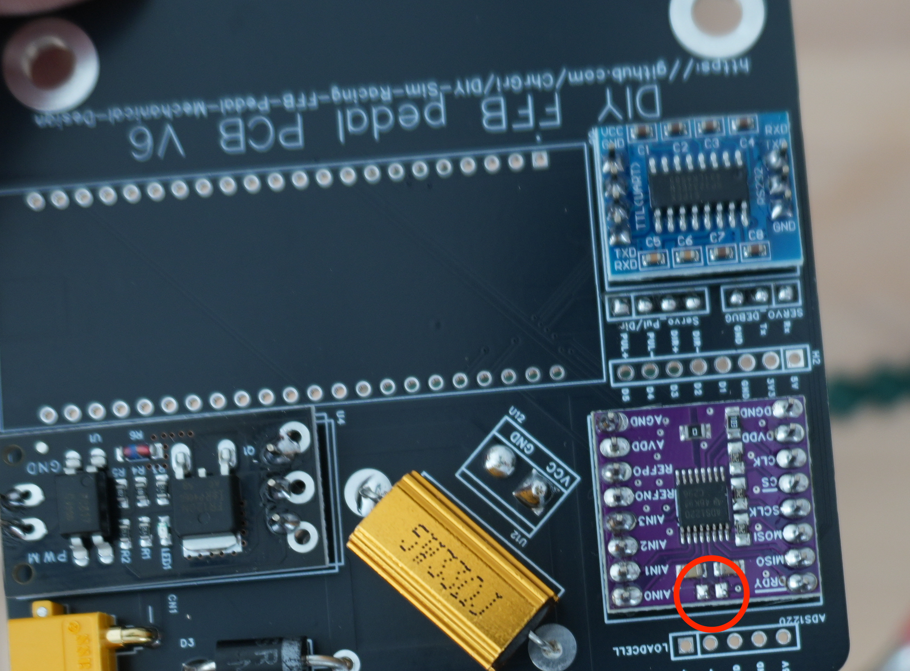

# ADS1220 assembly
Correct lengt pin headers came with the ADS1220. They were placed on the PCB, see  
. 

The ADS1220 was placed on the pins next  
. 

At first, the top pins have been soldered, afterwards the bottom pins were soldered. The final result is shown below  
  
. 

# Removing SMD resistor

In order to allow proper function, this onboard 0 Ohm SMD resistor has to be removed.
. 

 It was easily done by heating up the sides of the resistor quickly   
. 

