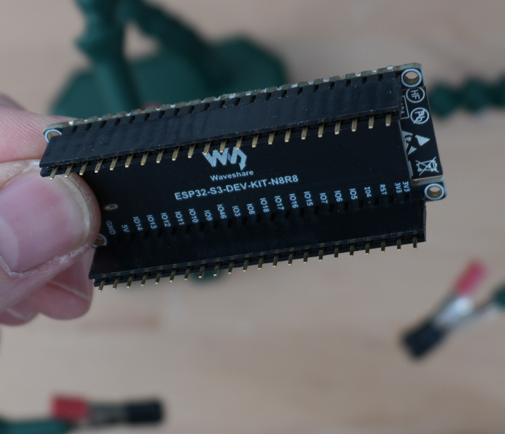
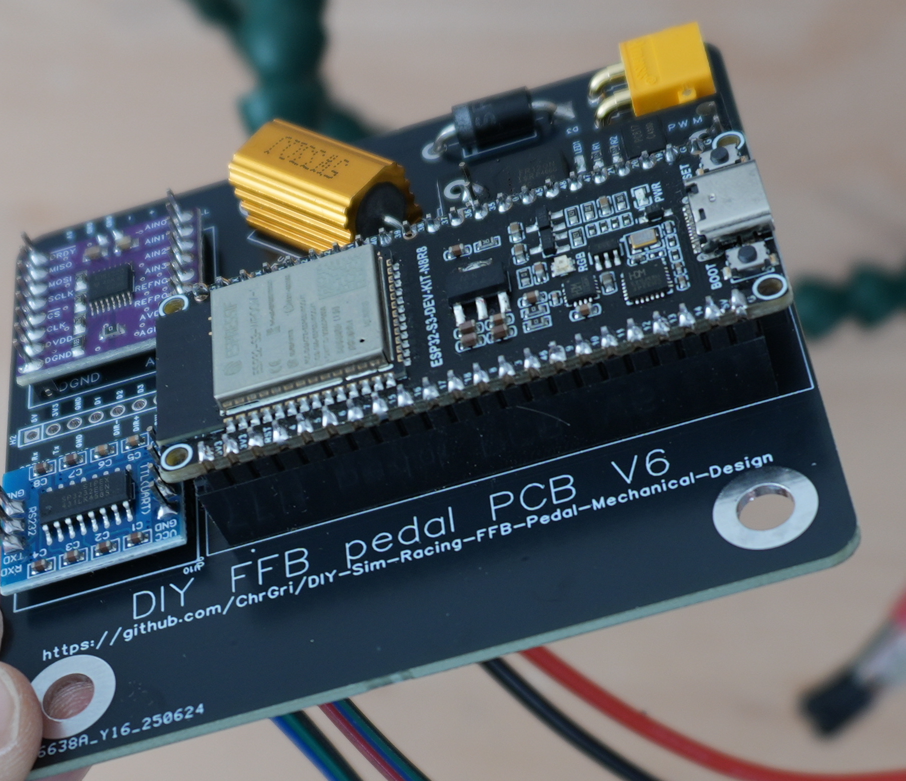

# ESP32 assembly
One can solder the ESP32 directly on the PCB. However, I like to have it easy removeable and therefore added additional female pin headers.

I've cut the pin headers to correct length, placed everything and then soldered first from top, then bottom of PCB, with the final result shown below  

. 

