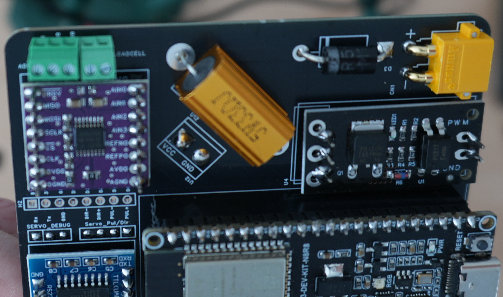
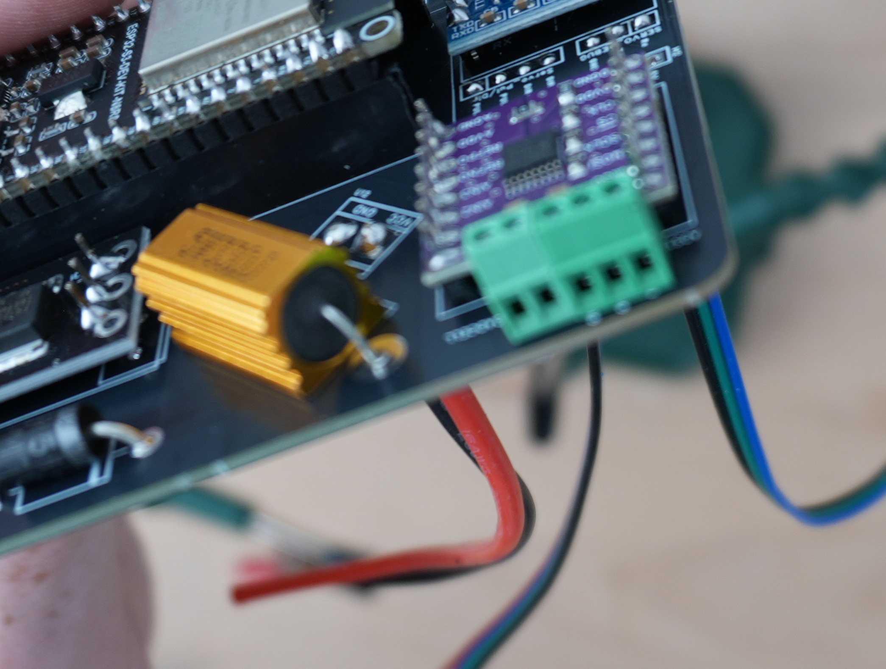

# Loadcell screw terminal
In order to connect the loadcell to the PCB, a screw terminal have been added, see

. 

Because I didn't have a 5 port screw terminal, I used a 3 and another 2 port terminal.

