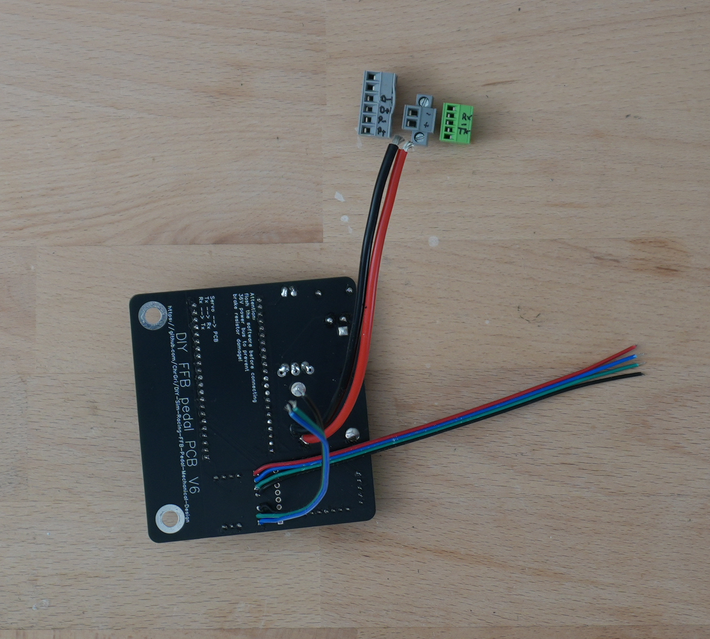
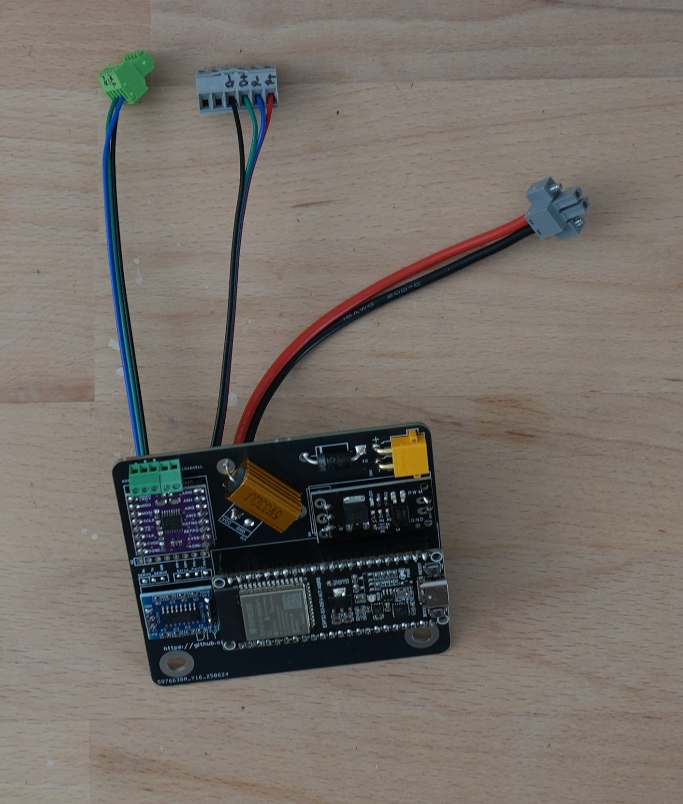
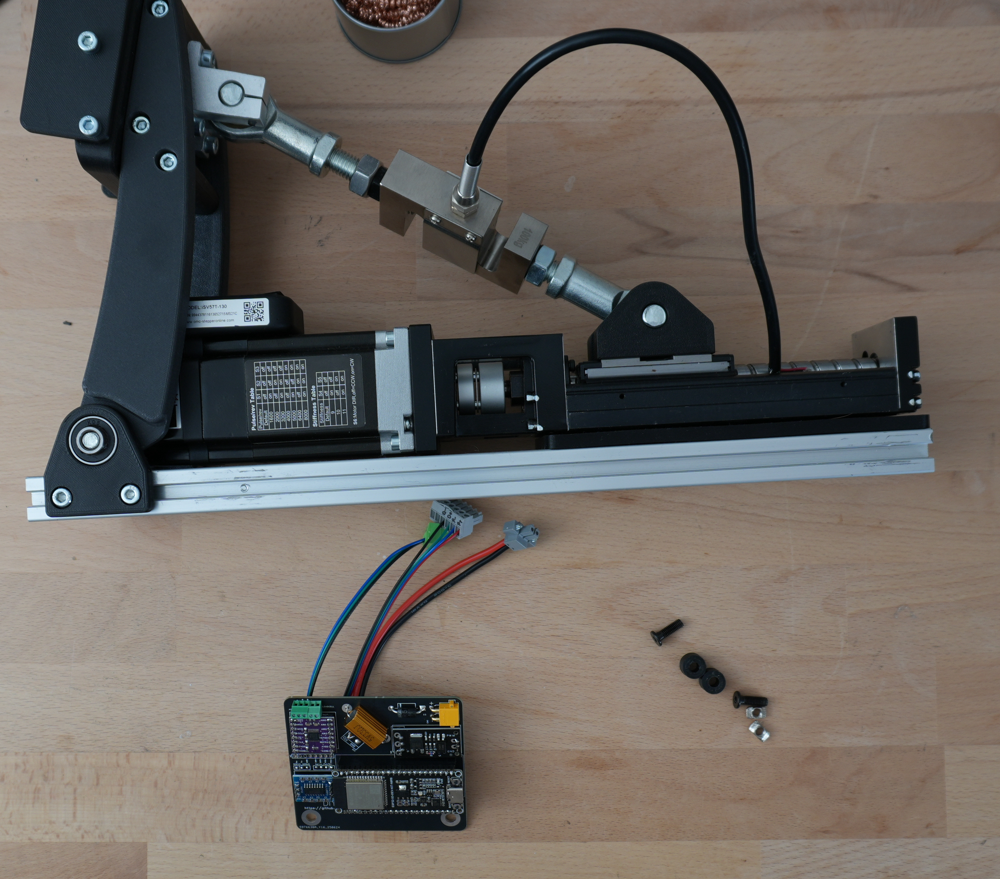

# Connecting all the wires
After soldering is complete, now it's time to connect the wires to the servo. 

For the sake of convenience, the screw terminals have been labeled with a marker, see  
.  
Then the wires were stripped a bit and before the connectors have been attached, see   
. 

# Connect the PCB to the pedal
To fix the board to the pedal, the 3d printed adapters and two M5x15mm screws and two t-nuts nuts have been used. 

.

To finalize the electronics, all connectors have been connected to the servo.

