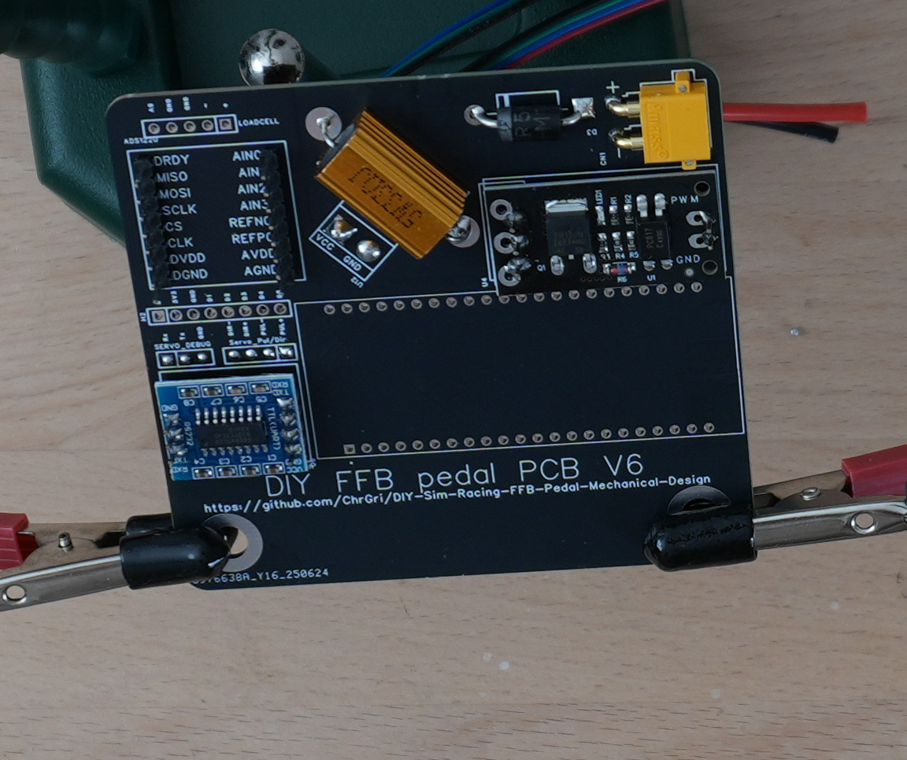
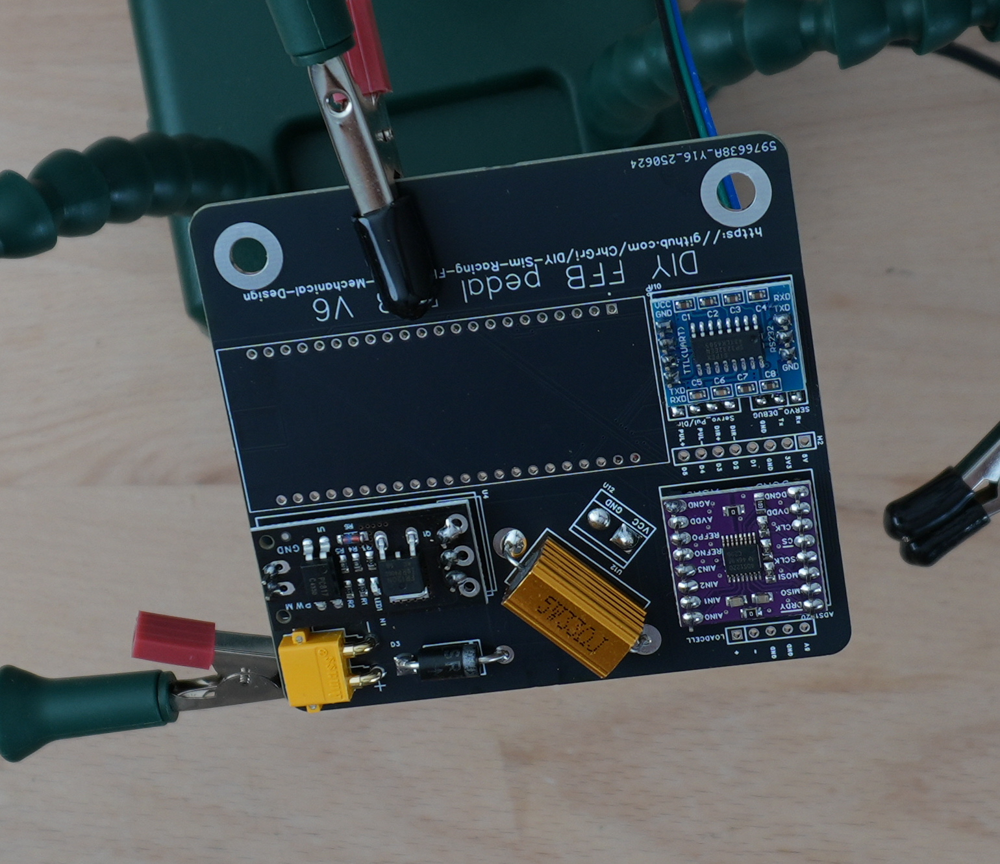
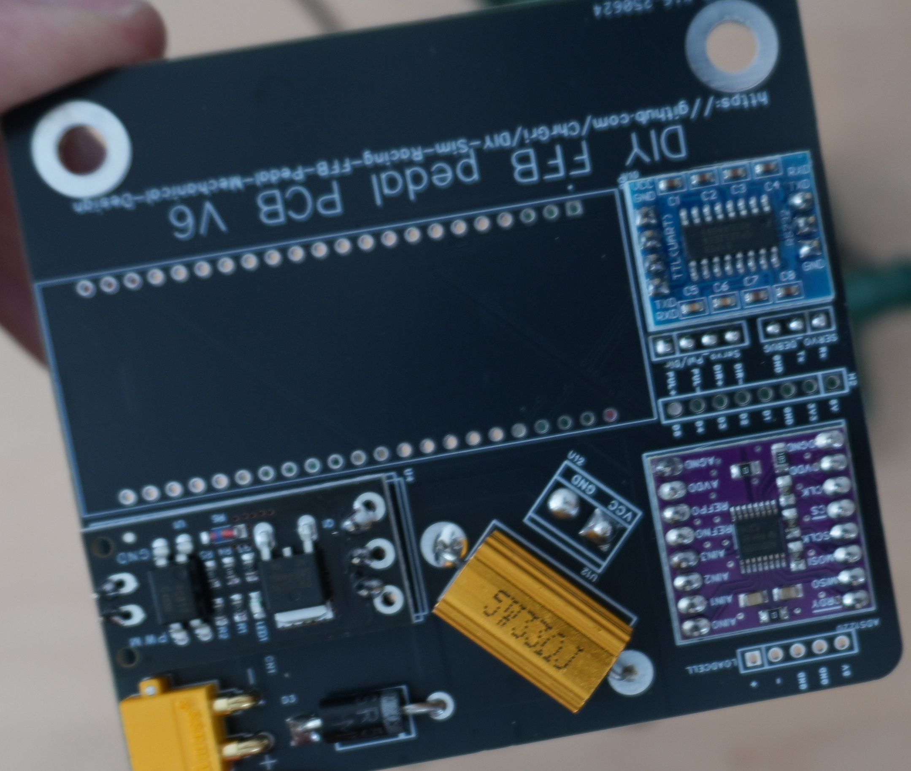
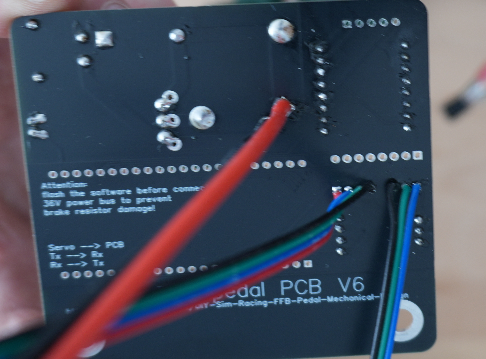
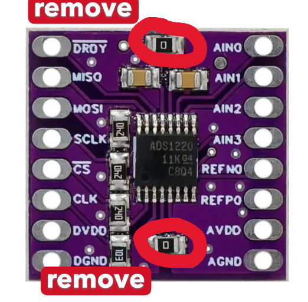

# ADS1220 assembly
Correct lengt pin headers came with the ADS1220. They were placed on the PCB, see  
. 

The ADS1220 was placed on the pins next  
. 

At first, the top pins have been soldered, afterwards the bottom pins were soldered. The final result is shown below  
  
. 

# Removing SMD resistor

In order to allow proper function, both onboard 0 Ohm SMD resistor have to be removed  
. 

It was easily done by heating up the sides of the resistor quickly.

> [!WARNING]
> If not removed, loadcell reading noise is increased because digital and analog GND are not separated, and the ESP can be damaged because 5 V and 3.3 V are shorted.