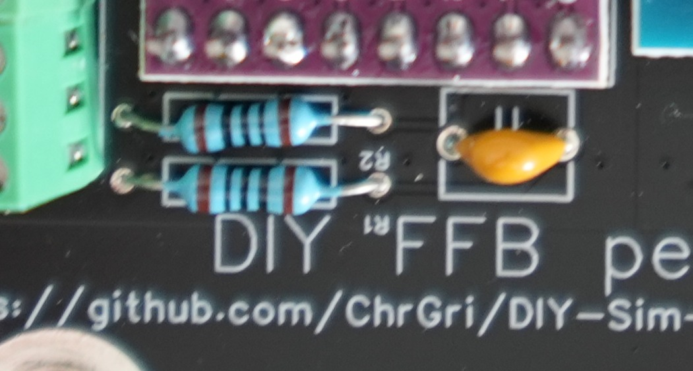

# 100 Ohm resistor soldering

Put the 2 100 Ohm resistors though the corresponding holes and solder them. Please follow this picture for guidance. 
After soldering, remove excessive wire from the PCB. Resistors don't have a polarity, therefore orientation is arbitrary.

.

# 100uF ceramic capacitor soldering
Put the 100uF ceramic capacitor though the corresponding hole and solder it. After soldering, remove excessive wire from the PCB. The capacitor doesn't have a polarity, therefore orientation is arbitrary.