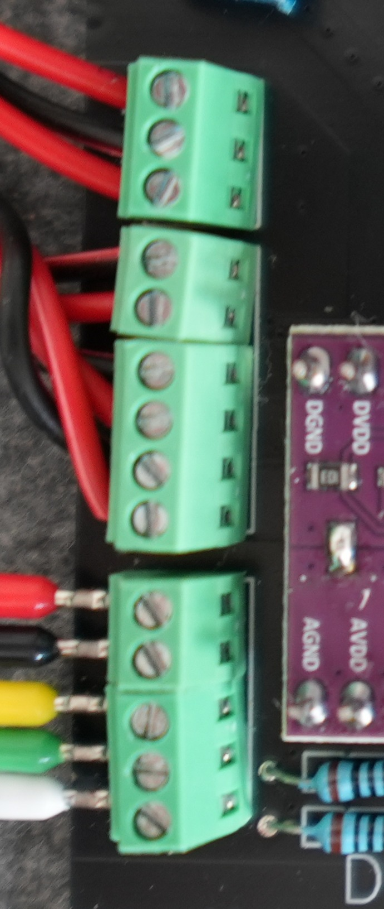

# Screw terminal soldering

1. Remove one terminal block from the blue screw terminal, delivered with the FR120 board with a rezor blade. Be carefull not to hurt yourself. We only need two of the terminals (VCC and GND) to power the servo.

2. Solder the blue terminal to the PCB. Make sure the inport is facing outwards, so wire can be attached properly. 

3. Solder a 3 port screw terminal to PCB, later used for RS232 communication.

4. Solder 2 port and 4 port screw terminal on PCB used for servos PUL/DIR/ALM communication.

5. Solder 2 port and 3 port screw terminal to PCB later used for loadcell connection. 

.

# Wire assembly

For wiring two power cables (AWG 18), a 3 wire and a 6 wire control cables (AWG 30) are needed. All wires were cut to 10cm length  

1. Connect the two AWG18 wires to the power screw terminals.

2. On the other end of the wires, connect the screw plug. Check the polarity after assembly. 

3. Connect 6 AWG 30 wires to the PUL/DIR/ALM screw terminal.

4. On the other end of the wires, connect the screw plug. Check the polarity after assembly. 

5. Connect the loadcell to the corresponding screw terminal. 

You can follow this picture to check the polarity of plugs, wires and screw terminals.  
.