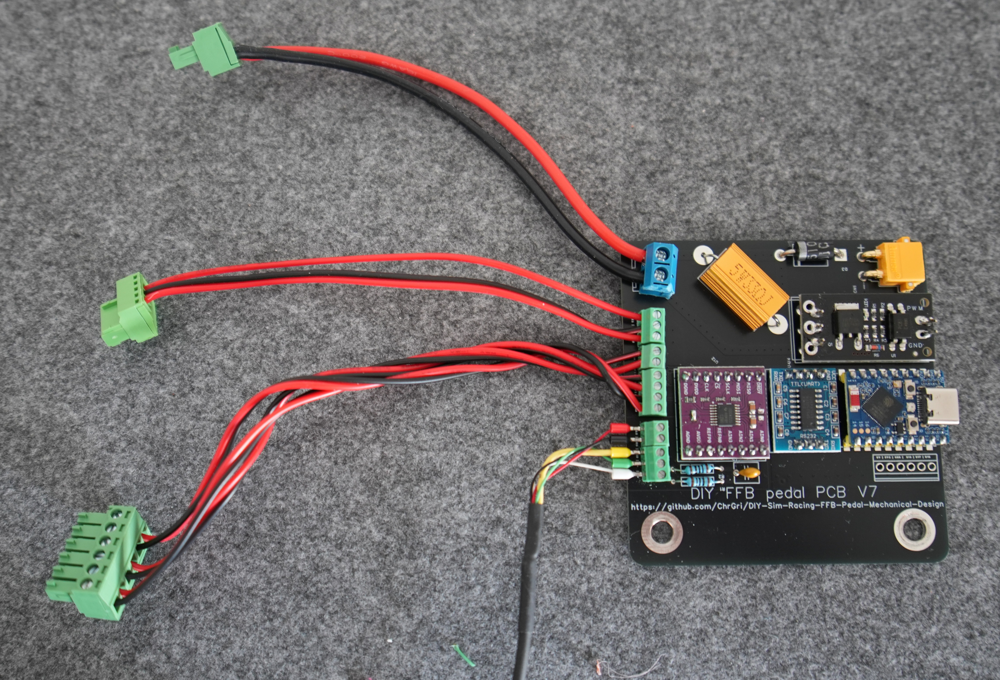

# Soldering tips

A good soldering iron makes your life easier. I like [TS80](https://s.click.aliexpress.com/e/_olD6hiU) and [TS101](https://s.click.aliexpress.com/e/_opJpOtW) soldering irons. 

Soldering tips can be found [here](https://www.youtube.com/watch?v=DfC5FBsud7o).

# Soldering

Please see [BOM](BOM/Electronics/README.md) for required parts. Some photos from the below assembly have been taken from the old V6 PCB design but apply similarly to V7 PCB design. The final assembly will look like this  
.  
Feel free to inspect this image whenever beeing unsure. Furthermore, there is a silk screen on the PCB to assist you finding the correct parts orientation.

All steps of the electronics assembly have been documented in sequence below:  

[1. Power ciruit](1-PowerCircuit)  
[2. SP3232 assembly](2-SP3232)  
[3. ADS1220 assembly](3-ADS1220)  
[4. RC-Filter](4-RC_Filter)  
[5. Wiring](5-Wiring)  
[6. Finalizing the electronics](6-Connection)  