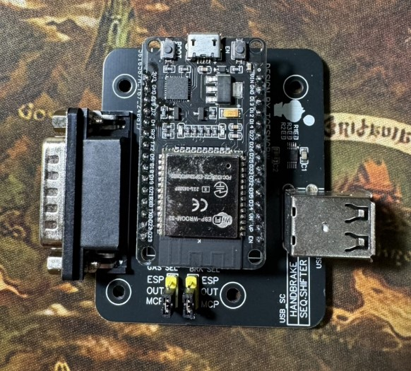
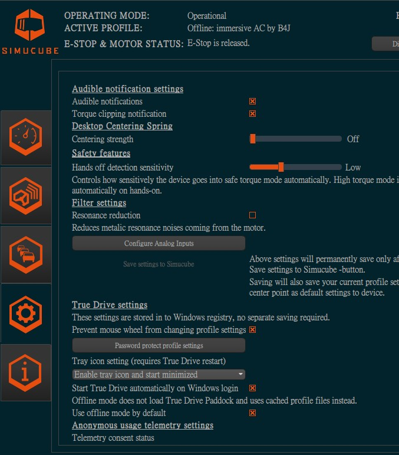
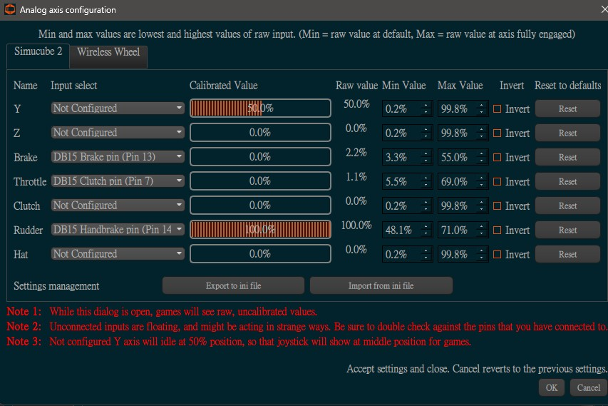

# SC D15 port shield 
Directly input analog data to simucube wheel base D15 port with ESPNow comunication. 
# Binary flashing 
Please flashing ESP32 with esp32_analogout_SC_D15.zip files. 
# PCB
 
This is the custom PCB from for the analog output with ESPNow comunication. 
If only 2 DIY FFB Pedal is used, the ESP32 dac output can be consider, no PCBA needed, only need make PCB and manually soldering for ESP32, connector, pins. 
If 3 pedals set, the MCP4728 is needed, the PCBA pickandplace file and BOM can be found in gerber folder. 
The shield is working without USB connection, the 5V is pull from sc wheelbase. 
# PCB BOM
|Component             |Quantity                      | Description                         |
|:-------------------------:|:-------------------------:|:-------------------------|
| PCB | 1||
| ESP32 30pins | 1| no serial chip requirment, because do not need serial comunicaiton|
| USB Connector Type-A Dual Port Female Jack | 1|[here](https://www.amazon.com/uxcell-Connector-Female-Horizontal-Degree/dp/B07L3M98V1/ref=sr_1_3?crid=CBLB87FB6M5&dib=eyJ2IjoiMSJ9.UzvHhQRXM0b2XNXTbxpYuGLr6NP3BVc3TGOsYMc6yTj8rIesyivrQFzaipsiikbmVeP224_-1jc2S4h8Wb0mx8kc0RcvdFWDtPW8CAPgFALteEngvaQbSnw0KWobCpDEnpaMkd1WZU4KWPUhV-fa-3HmMcINC0C92u-qYtX1PGKA_MEDbIMO2rpsYWI-m0jK3uWcKWUHpgdzbfyh0OiVs2Gt7FOVLhHQu2kyrbA39TM.Qsopcz0TCCQMS3-Nl9P7aRu44BAmiy0iPH2Z1dwKH6s&dib_tag=se&keywords=DUal+USB+female+PCB&qid=1724493545&sprefix=dual+usb+female+pcb%2Caps%2C278&sr=8-3)|
| DB15 Male Right Angle PCB Mount Connector | 1|[here](https://www.amazon.com/Pc-Accessories-Connectors-10-Pack-Connector/dp/B01DLKNHBO/ref=sr_1_4?crid=31ZRD8PSC1SZ4&dib=eyJ2IjoiMSJ9.VHT37e8HPICfaK7LftXQXslsX54HNk2qgSjgAxJy1tvmjA7EWcCvjQkCazlJyGvZcAO25oZFMWkwlel5AaMlphdH_-MCMKYhT13w_WdtQxvGfikZ4kYXZUHloDSL4rKhRWublLcalcuNFHV84ZO5c4x03Sq_IMhrLSYo4nOSCPDwopA69JvibUU9BV08U4tdq_R_xnBUhqhFYu29FkOCmI0qNqcmChf6qJHhTIkbDqU.N_RsFwSqCrHrmv0L4TiggKwrFsJ5Px4ZK7VBjXz_CTY&dib_tag=se&keywords=DB15+PCB+male&qid=1724493639&sprefix=db15+pcb+mal%2Caps%2C270&sr=8-4)|
| Male Header Pin Connector 2.54mm | 3 pins x2|[here](https://www.amazon.com/VKLSVAN-Connector-Prototype-Breadboard-Circuit/dp/B0CLYDRD1Y/ref=sr_1_4?crid=318XJRJLGGY6J&dib=eyJ2IjoiMSJ9.nBOjz-Q3x9YQz5Sx7sCs0FdFJt--tn8SEiiYB3mROsfBukFsijAcPA04aR3Z2picVwhfsYBf1ehQd7fgALvrvJHPBdofUFZ_bB64M5uqx-jScFdk95DDllUBCWEyAdP3_iK_RIJGIMlHOs2h51WBG_7-cFOLFY_uXuPOy2m_Jx45s8-GmYCm5pZVtpqlF7zfbLXGzfDIQJJq7nlcKjadWt7ahdq1qCxfCoxKuTtTPDE.lpvE92Fx93GScWoR4xSWgbnZ2epMHh4y3C9xf9pmsig&dib_tag=se&keywords=PCB+2.54+pins&qid=1724493690&sprefix=pcb+2.54+pin%2Caps%2C267&sr=8-4)|
| jumpper | 2|[here](https://www.amazon.com/California-JOS-Standard-Circuit-Connection/dp/B0BRK36G33/ref=sr_1_1?crid=30LNZUUE4MTYL&dib=eyJ2IjoiMSJ9.lCEDWjatiB670iu71cu7n4TpVqp3ijWAZ4ce_y7dksxxWL-VAMkGvn3XwOVUi2aBtIBV3FA1O_kHnTEZkyM3PSpxbdxYQhSReWbaxCAFObwA9JxXteX_oTspQ32q2Hvs8flYAB-9bOeULcJxKyEz0V9UcYlbCdkFdQminKBX1WbHRfc34we-lWcFWal8tFiCycIoA_6rlQkl_TeIzucxS1MPtsUQZf3BfDeDmL2imNY.yKrnr7bKgBoxCw3EnXOTQHuiSrEm6b23ELWjIq1bxQ8&dib_tag=se&keywords=pcb%2B2.54%2Bpins%2Bjumper&qid=1724493740&sprefix=pcb%2B2.54%2Bpins%2Bjumppe%2Caps%2C298&sr=8-1&th=1)|
| PCBA | 1|optional, MCP4728 and some resistor and caps, if only 2 pedals, the espDAC out can be considered|
# Simucube software configuare
There is a analog input config in truedrive. 
 
First set the brake use brake pin(other pins was fine, depend on the design) 
ESP32 output voltage was between 0.1-3.1, so set axis raw value between 3%-60%. 
 
after setup, don't forget to save to wheel base by click save setting to simucube. 

